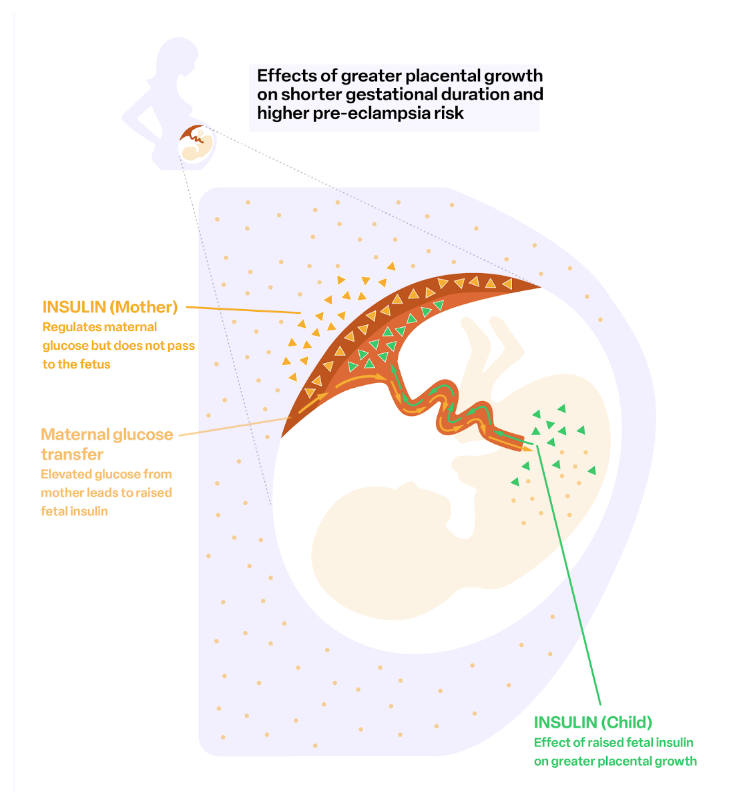

```{r libraries, warning=FALSE, results='hide', message=FALSE, echo=FALSE}

library(conflicted)
library(roadoi)

```

```{r functions, warning=FALSE, results='hide', message=FALSE, echo=FALSE}


#' Returns a string containing the link to the preprint, empty if null.
#' 
#' @param preprintDOI the preprint DOI
#' 
#' @return a string containing the link to the preprint, empty if null.
getPreprintLink <- function(preprintDOI = NULL) {
  
  if (!is.null(preprintDOI)) {
    
    return(paste0("[[Preprint](https://doi.org/", preprintDOI, ")]"))
    
  } else {
    
    return("")
    
  }
}

#' Returns a string containing the link to PubMed
#' 
#' @param pmid the pubmed id
#' 
#' @return a string containing the link to PubMed
getPubmedLink <- function(pmid = NULL) {
  
  if (is.null(pmid)) {
    
    return("[PubMed]")
    
  } else {
    
    return(paste0("[[PubMed id ", pmid ,"](https://www.ncbi.nlm.nih.gov/pubmed/", pmid, ")]"))
    
  }
}

#' Returns a string containing the DOI link
#' 
#' @param journalDOI the journal DOI
#' @param preprintDOI the preprint DOI
#' 
#' @return a string containing the DOI link
getDoiLink <- function(journalDOI = NULL, preprintDOI = NULL) {
  
  if (!is.null(journalDOI)) {
    
    return(paste0("[[doi: ", journalDOI, "](https://doi.org/", journalDOI, ")]"))
    
  } else if (!is.null(preprintDOI)) {
    
    return(paste0("[[doi: ", preprintDOI, "](https://doi.org/", preprintDOI, ")]"))
    
  } else {
    
    return("[no DOI yet]")
    
  }
}

#' Returns a string containing the link to pdf.
#' 
#' @param journalDOI the journal DOI
#' @param preprintDOI the preprint DOI
#' @param aam the path to the AAM
#' @param bora the path to bora
#' @param bora_pdf the path to the pdf in bora
#' 
#' @return a string containing the link to pdf
getPdfLink <- function(journalDOI = NULL, preprintDOI = NULL, aam = NULL, bora = NULL, bora_pdf = NULL) {
  
  if (!is.null(journalDOI)) {
    
    result <- NULL
    
    tryCatch(
      {
        result <- oadoi_fetch(
          dois = journalDOI, 
          email = "mvaudel@gmail.com"
        )
        
      }, error = function(error_condition) {
        
        print(paste0("unpaywall failed for doi: ", journalDOI))
        
      }
    )
    
    if (length(result) > 0 && result$is_oa) {
      
      oaLocation <- result$best_oa_location[[1]]
      
      if ("url_for_pdf" %in% names(oaLocation)) {
        
        return(paste0("[[pdf](", oaLocation$url_for_pdf, ")]"))
        
      } else {
        
        return(paste0("[[pdf](", oaLocation$url, ")]"))
        
      }
    }
  }
  
  if (!is.null(bora)) {
    
    return(paste0("[[BORA](", bora, ") - [pdf](", bora_pdf, ") ]"))
    
  }
  
  if (!is.null(preprintDOI)) {
    
    result <- NULL
    
    tryCatch(
      {
        result <- oadoi_fetch(
          dois = preprintDOI, 
          email = "mvaudel@gmail.com"
        )
        
      }, error = function(error_condition) {
        
        print(paste0("unpaywall failed for doi: ", journalDOI))
        
      }
    )
    
    if (length(result) > 0 && result$is_oa) {
      
      pdfUrl <- result$best_oa_location[[1]]$url_for_pdf
      
      return(paste0("[[pdf (preprint)](", pdfUrl, ")] [[Request a reprint](mailto:marc.vaudel@uib.no)]"))
      
    }
    
  }
  
  if (!is.null(aam)) {
    
    return(paste0("[[pdf (accepted version)](", aam, ")] [[Request a reprint](mailto:marc.vaudel@uib.no)]"))
    
  }
  
  
  return("[No Open Access found [Request a reprint](mailto:marc.vaudel@uib.no)]")
  
}

#' Returns a string containing the links
#' 
#' @param pmid the pubmed id
#' @param journalDOI the journal DOI
#' @param preprintDOI the preprint DOI
#' @param aam the path to the AAM
#' @param bora the URI to bora
#' 
#' @return a string containing the DOI link
getLinks <- function(pmid = NULL, journalDOI = NULL, preprintDOI = NULL, aam = NULL, bora = NULL, bora_pdf = NULL) {
  
  return(
    paste(
      getPubmedLink(
        pmid = pmid
      ),
      getPreprintLink(
        preprintDOI = preprintDOI
      ),
      getDoiLink(
        journalDOI = journalDOI, 
        preprintDOI = preprintDOI
      ),
      getPdfLink(
        journalDOI = journalDOI,
        preprintDOI = preprintDOI,
        aam = aam,
        bora = bora,
        bora_pdf = bora_pdf
      )
    )
  )
  
}


```

 with the submission This repository lists the scientific publications co-authored by [Marc Vaudel](https://www.uib.no/en/persons/Marc.Vaudel) as of `r format(Sys.time(), "%d.%m.%Y")`. 


- [ORCID: 0000-0003-1179-9578](https://orcid.org/0000-0003-1179-9578)
- [OpenAlex](https://openalex.org/works?page=1&filter=authorships.author.id%3AA5037607788&sort=cited_by_count%3Adesc&group_by=publication_year,type)
- [Google Scholar](https://scholar.google.com/citations?user=JTK8FTkAAAAJ)

<br>

> <sup>1</sup> shared first, <sup>$</sup> correspondence, <sup>†</sup> shared last. 

<br>

## Ten highlighted recent publications

1. Kentistou KA, Sundfjord J, Karimi R, Kaisinger LR, Hofmeister RJ, Lupu AE, Fragoso-Bargas N, Zhao Y, Tadrass JA, Dowsett GK, Lockhart S, Bruening JC, Liu J, Davitte AJ, Clement L, Havdahl A, Andreassen OA, Bratland E, Lam BYH, O'Rahilly S, Yeo GSH, Njølstad PR, Kutalik Z, Day FR<sup>†</sup>, **Vaudel M**<sup>†</sup>, Perry JRB<sup>†</sup>, Ong KK<sup>†</sup>, Johansson S<sup>†,$</sup>. _The role of common and rare genetic variation on adiposity across childhood_, preprint. [[Preprint]( 	
https://doi.org/10.1101/2025.05.13.25327505)]

<table>
<tr>
<td width="150">
<p></p>
</td>
<td>
<p style="font-size:10px;"><i>A multi-phenotypes analysis of the genetics of childhood adiposity.</i></p>
</td>
</tr>
</table>
<br>

2. Fejzo M<sup>†,$</sup>, Wang X, Zöllner J, Pujol-Gualdo N, Laisk T; Estonian Biobank Research Team; Finer S, van Heel DA; Genes & Health Research Team; Brumpton B, Bhatta L, Hveem K, Jasper EA, Velez Edwards DR, Hellwege JN, Edwards T, Jarvik GP, Luo Y, Khan A, MacGibbon K, Gao Y, Ge G, Averbukh I, Soon E, Angelo M, Magnus P, Johansson S, Njølstad PR, **Vaudel M**<sup>†</sup>, Shu C<sup>†</sup>, Mancuso N<sup>†</sup>. _Multi-ancestry GWAS of severe pregnancy nausea and vomiting identifies risk loci associated with appetite, insulin signaling, and brain plasticity_, preprint. [[Preprint](https://doi.org/10.1101/2024.11.19.24317559)]

<table>
<tr>
<td width="150">
<p></p>
</td>
<td>
<p style="font-size:10px;"><i>Our latest meta-analysis of the genetics of nausea and vomiting during pregnancy. We confirm the association with GDF15 in multiple cohorts and link to health consequences during pregnancy.</i></p>
</td>
</tr>
</table>
<br>

3. Vašíček J, Kuznetsova KG, Skiadopoulou D, Njølstad PR, Johansson S, Bruckner S<sup>†</sup>, Käll L<sup>†</sup>, **Vaudel M**<sup>†,$</sup>. _ProHap enables proteomic database generation accounting for population diversity_, Nature Methods, 2025. `r getLinks(pmid = "39653819", journalDOI = "10.1038/s41592-024-02506-0")`

<table>
<tr>
<td width="150">
<p></p>
</td>
<td>
<p style="font-size:10px;"><i>ProHap enables the creation of protein sequence databases from reference phased haplotypes. The tool can be used on public or private reference panels to build protein sequence databases that reflect the sequence diversity of a study population. Along with the tool, we provide protein sequences derived from the common haplotypes of the thousand genomes redily usable for proteomic studies: <a href="https://doi.org/10.5281/zenodo.10149278">doi
10.5281/zenodo.10149278</a>.</i></p>
</td>
</tr>
</table>
<br>

4. Kuznetsova KG<sup>$</sup>, Vašíček J, Skiadopoulou D, Molnes J, Udler M, Johansson S, Njølstad PR, Manning A<sup>†</sup>, **Vaudel M**<sup>†,$</sup>. _A systematic mapping of the genomic and proteomic variation associated with monogenic diabetes_, Plos One, 2024. `r getLinks(pmid = "38635808", journalDOI = "10.1371/journal.pone.0300350")`

<table>
<tr>
<td width="150">
<p></p>
</td>
<td>
<p style="font-size:10px;"><i>A pipeline that maps, curates, and consolidates the variants associated with monogenic diabetes and translate their consequences to the protein level onto common haplotypes. We use this pipeline to design custom proteomics database and mine for variant peptides in the Norwegian diabetes registries. The pipeline can be used for other diseases.</i></p>
</td>
</tr>
</table>
<br>

5. Skiadopoulou D, Vašíček J, Kuznetsova KG, Käll L<sup>†</sup>, **Vaudel M**<sup>†,$</sup>. _Retention time and fragmentation predictors increase confidence in variant peptide identification_, Journal of Proteome Research, 2023. `r getLinks(pmid = "37656829", journalDOI = "10.1021/acs.jproteome.3c00243")`

<table>
<tr>
<td width="150">
<p></p>
</td>
<td>
<p style="font-size:10px;"><i>We demonstrate that common variation can be included without affecting the identification rate. We further show how retention time and fragmentation predictors can be used to help the machine learning-based Percolator distinguish variant peptides from similar, possibly modified, peptides.</i></p>
</td>
</tr>
</table>
<br>

6. Vašíček J<sup>1</sup>, Skiadopoulou D<sup>1</sup>, Kuznetsova KG, Wen B, Johansson S, Njølstad PR, Bruckner S, Käll L<sup>†</sup>, **Vaudel M**<sup>†,$</sup>. _Finding Haplotypic Signatures in Proteins_, Gigascience, 2023. `r getLinks(pmid = "37919975", journalDOI = "10.1093/gigascience/giad093")`

<table>
<tr>
<td width="150">
<p></p>
</td>
<td>
<p style="font-size:10px;"><i>A study of the distribution of protein haplotypes, and whether they can be identified by mass spectrometry. We show the prevalence of muli-variant peptides that can be identified, and how these are difficult to distinguish from similar peptides carrying PTMs.</i></p>
</td>
</tr>
</table>
<br>

7. Beaumont RN<sup>1</sup>, Flatley C<sup>1</sup>, **Vaudel M**<sup>1</sup>, Xiaoping W, Chen J, Moen GH, Skotte L, Helgeland Ø, Sole-Navais P, Banasik K, Albiñana C, Ronkainen J, Fadista J, Stinson SE, Trajanoska K, Wang CA, Westergaard D, Srinivasan S, Sánchez-Soriano C, Bilbao JR, Allard C, Groleau M, Kuulasmaa T, Leirer DJ, White F, Jacques PE, Cheng H, Hao K, Andreassen OA, Åsvold BO, Atalay M, Bhatta L, Bouchard L, Brumpton BM, Brunak S, Bybjerg-Grauholm J, Ebbing C, Elliott P, Engelbrechtsen L, Erikstrup C, Estarlich M, Franks S, Gaillard R, Geller F, Grove J, Hougaard DM, Kajantie E, Morgen CS, Nohr EA, Nyegaard M, Palmer CNA, Pedersen OB, The Early Growth Genetics (EGG) Consortium, Rivadeneira F, Sebert S, Shields BM, Stoltenberg C, Surakka I, Thørner LW, Ullum H, Vaarasmaki M, Vilhjalmsson BJ, Willer CJ, Lakka TA, Gybel-Brask DJ, Bustamante M, Hansen T, Pearson ER, Reynolds R, Ostrowski SR, Pennell CE, Jaddoe VWV, Felix JF, Hattersley AT, Melbye M, Lawlor DA, Hveem K, Werge T, Nielsen HS, Magnus P, Evans DM, Jacobsson B, Järvelin MR, Zhang G, Hivert MF, Johansson S<sup>†</sup>, Freathy RM<sup>†</sup>, Feenstra B<sup>†</sup>, Njølstad PR<sup>†,$</sup>. _
_Genome-wide association study of placental weight identifies distinct and shared genetic influences between placental and fetal growth_, Nature Genetics, 2023. `r getLinks(pmid = "37798380", journalDOI = "10.1038/s41588-023-01520-w")`

<table>
<tr>
<td width="150">
<p></p>
</td>
<td>
<p style="font-size:10px;"><i>The first genome-wide analysis of placental weight. A multi-year meta-analysis from the Early Growth Genetics (EGG) consortium including the Norwegian Mother, Father and Child Cohort Study (MoBa). We provide association results with the genomes of the children and parents, study modes of association, the relationship with birth weight, and to other traits.</i></p>
</td>
</tr>
</table>
<br>

8. Hernández Sánchez LF, Burger B, Castro Campos RA, Johansson S, Njølstad PR, Barsnes H<sup>†</sup>, **Vaudel M**<sup>†,$</sup>. _Extending protein interaction networks using proteoforms and small molecules_, Bioinformatics, 2023. `r getLinks(pmid = "37756698", journalDOI = "10.1093/bioinformatics/btad598")`

<table>
<tr>
<td width="150">
<p></p>
</td>
<td>
<p style="font-size:10px;"><i>We study how the structure of pathway-derived interaction networks change upon the inclusion of information on proteoforms and small molecules. We show how accounting for proteoform information allows refining the representation of protein interactions and how small molecules increase the connectivity of the network. But at the same time accounting for this information can create artefacts in the topology of the network.</i></p>
</td>
</tr>
</table>
<br>

9. Helgeland Ø<sup>1</sup>, **Vaudel M**<sup>1</sup>, Sole-Navais P, Flatley C, Juodakis J, Bacelis J, Koløen IL, Peggy Knudsen G, Johansson BB, Magnus P, Reichborn Kjennerud T, Juliusson PB, Stoltenberg C, Holmen OL, Andreassen OA, Jacobsson B, Njølstad PR<sup>$</sup>, Johansson S<sup>$</sup>. _Characterization of the genetic architecture of BMI in infancy and early childhood reveals age-specific effects and implicates pathways involved in Mendelian obesity_, Nature Metabolism, 2022. `r getLinks(pmid = "35315439", journalDOI = "10.1038/s42255-022-00549-1")`

<table>
<tr>
<td width="150">
<p></p>
</td>
<td>
<p style="font-size:10px;"><i>Association of BMI during childhood with common variation - we identify different trajectory clusters, time-dependent parent-of-origin effects, and show how the performance of risk scores evolve during early growth.</i></p>
</td>
</tr>
</table>
<br>

10. Hernández Sánchez LF, Burger B, Horro C, Fabregat A, Johansson S, Njølstad PR, Barsnes H, Hermjakob H, **Vaudel M**<sup>$</sup>. _PathwayMatcher: proteoform-centric network construction enables fine-granularity multi-omics pathway mapping_, GigaScience, 2019. `r getLinks(pmid = "31363752", journalDOI = "10.1093/gigascience/giz088")`

<table>
<tr>
<td width="150">
<p></p>
</td>
<td>
<p style="font-size:10px;"><i>PathwayMatcher can build biological networks of different levels of granularity using the Reactome pathway database, and map different types of omics data to it. Notably, it can build a network to the level of proteoforms, where genes and proteins are separated according to their post-translational state. Hence, interactions are more specific, and interactions between different forms of the same proteins become visible as connections between different nodes, thus providing a new dimension to study biological networks.</i></p>
</td>
</tr>
</table>
<br>


## Research Articles

1. Ytterberg K<sup>$</sup>, Sundelin H, Juodakis J, **Vaudel M**, Corfield EC, Andreassen OA, Magnus P, Havdahl A, Nilsson S, Njølstad PR, Johansson S, Jacobsson B<sup>$</sup>, Solé-Navais P<sup>†,$</sup>. _Parity modifies the effect of genetic variants associated with gestational duration and birth weight_, preprint. [[Preprint](https://doi.org/10.1101/2025.06.17.25329777)]

1. Parehk P<sup>$</sup>, Parker N, Pecheva D, Frei E, **Vaudel M**, Smith DM, Rigby A, Jaholkowski P, Sønderby IE, Birkenæs V, Bakken NR, Fan CC, Makowski C, Kopal J, Loughnan R, Hagler Donald J Kr, van der Meer D, Johansson S ,Njølstad PR, Jernigan TL, Thompson WK, Frei Oleksandr, Shadrin AA, Nichols TE, Andreassen OA<sup>†</sup>, Dale AM<sup>†,$</sup>. _FEMA-Long: Modeling unstructured covariances for discovery of time-dependent effects in large-scale longitudinal datasets_, preprint. [[Preprint](https://doi.org/10.1101/2025.05.09.653146)]

1. Skiadopoulou D, Käll L, Barsnes H, Schwämmle V, **Vaudel M**<sup>†,$</sup>. _A graph-based approach for modification site assignment in proteomics_, preprint. [[Preprint](https://doi.org/10.48550/arXiv.2505.17755)]

1. Unger L, Larsen U, Sharmine S, Hossain MK, Legøy TA, **Vaudel M**, Ghila L, Chera S<sup>†,$</sup>. _SAM: A FIJI-Based Tool for Semi-Automated Quantification of Cytoplasmic Expression in Cells_, preprint. [[Preprint](https://doi.org/10.21203/rs.3.rs-6466373/v1)]

1. Artaza H, Priyanka Tallapragada DS, Molnes J, Lavrichenko K, Wolff ASB, Røyrvik EC, Skrivarhaug T, **Vaudel M**, Bratland E, Johansson BB, Njølstad PR, Johansson S<sup>$</sup>. _Contribution of Rare Large High-Penetrance CNVs to Pediatric and MODY Diabetes in Norway_, preprint. [[Preprint](https://doi.org/10.1101/2025.02.25.25322584 )]

1. Kentistou KA, Sundfjord J, Karimi R, Kaisinger LR, Hofmeister RJ, Lupu AE, Fragoso-Bargas N, Zhao Y, Tadrass JA, Dowsett GK, Lockhart S, Bruening JC, Liu J, Davitte AJ, Clement L, Havdahl A, Andreassen OA, Bratland E, Lam BYH, O'Rahilly S, Yeo GSH, Njølstad PR, Kutalik Z, Day FR<sup>†</sup>, **Vaudel M**<sup>†</sup>, Perry JRB<sup>†</sup>, Ong KK<sup>†</sup>, Johansson S<sup>†,$</sup>. _The role of common and rare genetic variation on adiposity across childhood_, preprint. [[Preprint](https://doi.org/10.1101/2025.05.13.25327505)]

1. Vašíček J, Skiadopoulou D, Kuznetsova KG, Käll L<sup>†</sup>, **Vaudel M**<sup>†</sup>, Bruckner S<sup>†,$</sup>. _ProHap Explorer: Visualizing Haplotypes in Proteogenomic Datasets_, preprint. [[Preprint](https://doi.org/10.48550/arXiv.2504.06282)]

1. Fejzo M<sup>†,$</sup>, Wang X, Zöllner J, Pujol-Gualdo N, Laisk T; Estonian Biobank Research Team; Finer S, van Heel DA; Genes & Health Research Team; Brumpton B, Bhatta L, Hveem K, Jasper EA, Velez Edwards DR, Hellwege JN, Edwards T, Jarvik GP, Luo Y, Khan A, MacGibbon K, Gao Y, Ge G, Averbukh I, Soon E, Angelo M, Magnus P, Johansson S, Njølstad PR, **Vaudel M**<sup>†</sup>, Shu C<sup>†</sup>, Mancuso N<sup>†</sup>. _Multi-ancestry GWAS of severe pregnancy nausea and vomiting identifies risk loci associated with appetite, insulin signaling, and brain plasticity_, preprint. [[Preprint](https://doi.org/10.1101/2024.11.19.24317559)]

1. Hofmeister RJ, Cavinato T, Karimi R, van der Graaf A, Pajuste F-D, Kronberg J, Taba N, Estonian Biobank research team, Mägi R, **Vaudel M**, Rubinacci S, Johansson S, Milani L, Delaneau O, Kutalik Z. _Parent-of-Origin inference and its role in the genetic architecture of complex traits: evidence from ∼265,000 individuals_, preprint. [[Preprint](https://doi.org/10.1101/2024.12.03.24318392)]

1. Lammi V<sup>1</sup>, Nakanishi T<sup>1</sup>, Jones SE<sup>1</sup>, Andrews SJ, Karjalainen J, Cortés B, O’Brien HE, Fulton-Howard BE, Haapaniemi HH, Schmidt A, Mitchell RE, Mousas A, Mangino M, Huerta-Chagoya A, Sinnott-Armstrong N, Cirulli ET, **Vaudel M**, Kwong ASF, Maiti AK, Marttila M, Batini C, Minnai F, Dearman AR, Warmerdam R, Sequeros CB, Winkler TW, Jordan DM, Guare L, Vergasova E, Marouli E, Striano P, Zainulabid UA, Kumar A, Ahmad HF, Edahiro R, Azekawa S, Long COVID Host Genetics Initiative, FinnGen, DBDS Genomic Consortium, GEN-COVID Multicenter Study, Grzymski JJ, Ishii M, Okada Y, Beckmann ND, Kumari M, Wagner R, Heid IM, John C, Short PJ, Magnus P, Banasik K, Geller F, Franke LH, Rakitko A, Duncan EL, Renieri A, Tsilidis KK, de Cid R, Niavarani A, Tusié-Luna T, Verma SS, Davey Smith G, Timpson NJ, Daly MJ, Ganna A, Schulte EC, Brent Richards J, Ludwig KU, Hultström M, Zeberg H<sup>†,$</sup>, Ollila HM<sup>†,$</sup>. _Genome-wide Association Study of Long COVID_, Nature Genetics, 2025. `r getLinks(pmid = "40399555", journalDOI = "10.1038/s41588-025-02100-w")`

1. Vašíček J, Kuznetsova KG, Skiadopoulou D, Njølstad PR, Johansson S, Bruckner S<sup>†</sup>, Käll L<sup>†</sup>, **Vaudel M**<sup>†,$</sup>. _ProHap enables proteomic database generation accounting for population diversity_, Nature Methods, 2025. `r getLinks(pmid = "39653819", journalDOI = "10.1038/s41592-024-02506-0")`

1. Artaza H, Lavrichenko K, Wolff ASB, Røyrvik EC, **Vaudel M**, Johansson S<sup>$</sup>. _Rare Copy Number Variant analysis in case-control studies using SNP Array Data: a scalable and automated data analysis pipeline_, BMC Bioinformatics, 2024. `r getLinks(pmid = "39548362", journalDOI = "10.1186/s12859-024-05979-0")`

1. Sole-Navais P<sup>1,$</sup>, Juodakis J<sup>1</sup>, Ytterberg K, Xiaoping W, **Vaudel M**, Helgeland Ø, Flatley C, Geller F, Magnus P, Andreassen OA, Njolstad PR, Feenstra B, Muglia LJ, Johanson S, Jacobsson B<sup>$</sup>. _Genome-wide analysis of neonatal jaundice reveals a marked departure from adult bilirubin metabolism_, Nature Communications, 2024. `r getLinks(pmid = "39214992", journalDOI = "10.1038/s41467-024-51947-w")`

1. Olwi DI, Kaisinger LR KG, Kentistou KA, **Vaudel M**, Stankovic S, Njølstad PR, Johansson S, Perry JRB, Day FR, Ong KK<sup>†,$</sup>. _Likely causal effects of insulin resistance and IGF-1 bioaction on childhood and adult adiposity: a Mendelian randomization study _, International Journal of Obesity, 2024. `r getLinks(pmid = "39174749", journalDOI = "10.1038/s41366-024-01605-4")`

1. Kentistou KA<sup>1</sup>, Kaisinger LR<sup>1</sup>, Stankovic S, **Vaudel M**, de Oliveira EM, Messina A, Walters RG, Liu X, Busch AS, Helgason H, Thompson DJ, Santon F, Petricek KM, Zouaghi Y, Huang-Doran I, Gudbjartsson DF, Bratland E, Lin K, Gardner EJ, Zhao Y, Jia R, Terao C, Riggan M, Bolla MK, Yazdanpanah M, Yazdanpanah N, Bradfield JP, Broer L, Campbell A, Chasman DI, Cousminer DL, Franceschini N, Franke LH, Girotto G, He C, Järvelin MR, Joshi PK, Kamatani Y, Karlsson R, Luan J, Lunetta KL, Mägi R, Mangino M, Medland SE, Meisinger C, Noordam R, Nutile T, Concas MP, Polašek O, Porcu E, Ring SM, Sala C, Smith AV, Tanaka T, van der Most PJ, Vitart V, Wang CA, Willemsen G, Zygmunt M, Ahearn TU, Andrulis IL, Anton-Culver H, Antoniou AC, Auer PL, Barnes CL, Beckmann MW, Berrington A, Bogdanova NV, Bojesen SE, Brenner H, Buring JE, Canzian F, Chang-Claude J, Couch FJ, Cox A, Crisponi L, Czene K, Daly MB, Demerath EW, Dennis J, Devilee P, Vivo I, Dörk T, Dunning AM, Dwek M, Eriksson JG, Fasching PA, Fernandez-Rhodes L, Ferreli L, Fletcher O, Gago-Dominguez M, García-Closas M, García-Sáenz JA, González-Neira A, Grallert H, Guénel P, Haiman CA, Hall P, Hamann U, Hakonarson H, Hart RJ, Hickey M, Hooning MJ, Hoppe R, Hopper JL, Hottenga JJ, Hu FB, Hubner H, Hunter DJ, ABCTB Investigators, Jernstrom H, John EM, Karasik D, Khusnutdinova EK, Kristensen VN, Lacey JV, Lambrechts D, Launer LJ, Lind PA, Lindblom A, Magnusson PKE, Mannermaa A, McCarthy mi, Meitinger T, Menni C, Michailidou K, Millwood IY, Milne RL, Montgomery GW, Nevanlinna H, Nolte IM, Nyholt DR, Obi N, O'Brien KM, Offit K, Oldehinkel AJ, Ostrowski SR, Palotie A, Pedersen OB, Peters A, Pianigiani G, Plaseska-Karanfilska D, Pouta A, Pozarickij A, Radice P, Rennert G, Rosendaal FR, Ruggiero D, Saloustros E, Sandler DP, Schipf S, Schmidt CO, Schmidt MK, Small K, Spedicati B, Stampfer M, J Stone, Tamimi RM, TerasLR, Tikkanen E, Turman C, Vachon CM, Wang Q, Winqvist R, Wolk A, Zemel BS, Zheng W, van Dijk KW, Alizadeh BZ, Bandinelli S, Boerwinkle E, Boomsma DI, Ciullo M, Chenevix-Trench G, Cucca F, Esko T, Gieger C, Grant SFA, Gudnason V, Hayward C, Kolcic I, Kraft P, Lawlor DA, Martin NG, Nohr EA, Pedersen NL, Pennell CE, Ridker PM, Robino A, Snieder H, Sovio U, Spector TD, Stockl D, Sudlow C, Timpson NJ, Toniolo D, Uitterlinden A, Ulivi S, VolzkeH, Wareham NJ, Widen E, Wilson JF, The Lifelines Cohort Study, The Danish Blood Donor study, The Ovarian Cancer Association Consortium, The Breast Cancer Association Consortium, The Biobank Japan Project, The China Kadoorie Biobank Collaborative Group, Pharoah PDP, Li L, Easton DF, Njølstad pr, Sulem P, Murabito JM, Murray A, Manousaki D, Juul A, ErikstrupC, Stefansson K, Horikoshi M, Chen Z, Farooqi IS, Pitteloud N, JohanssonS, Day FR<sup>†</sup>, Perry JRB<sup>†,$</sup>, Ong KK<sup>†</sup>. _Understanding the genetic complexity of puberty timing across the allele frequency spectrum_, Nature Genetics, 2024. `r getLinks(pmid = "38951643", journalDOI = "10.1038/s41588-024-01798-4")`

1. Kuznetsova KG<sup>$</sup>, Vašíček J, Skiadopoulou D, Molnes J, Udler M, Johansson S, Njølstad PR, Manning A<sup>†</sup>, **Vaudel M**<sup>†,$</sup>. _A systematic mapping of the genomic and proteomic variation associated with monogenic diabetes_, Plos One, 2024. `r getLinks(pmid = "38635808", journalDOI = "10.1371/journal.pone.0300350")`

1. Jaitner A, **Vaudel M**, Tsaneva-Atanasova K, Njølstad PR, Jacobsson B, Bowden J, Johansson S, Freathy R<sup>$</sup>. _Smoking during pregnancy and its effect on placental weight: A Mendelian randomization study_,  BMC Pregnancy Childbirth, 2024. `r getLinks(pmid = "38575863", journalDOI = "10.1186/s12884-024-06431-0")`

1. Artaza H, Eriksson D, Lavrichenko K, Aranda-Guillén M, Bratland E, **Vaudel M**, Knappskog P, Husebye E, Bensing S, Wolff ASB, Kämpe O, Røyrvik EC<sup>$</sup>, Johansson S<sup>$</sup>. _Rare copy number variation in autoimmune Addison’s disease_, Frontiers in Immunology, 2024. `r getLinks(pmid = "38562931", journalDOI = "10.3389/fimmu.2024.1374499")`

1. Vašíček J<sup>1</sup>, Skiadopoulou D<sup>1</sup>, Kuznetsova KG, Wen B, Johansson S, Njølstad PR, Bruckner S, Käll L<sup>†</sup>, **Vaudel M**<sup>†,$</sup>. _Finding Haplotypic Signatures in Proteins_, GigaScience, 2023. `r getLinks(pmid = "37919975", journalDOI = "10.1093/gigascience/giad093")`

1. Beaumont RN<sup>1</sup>, Flatley C<sup>1</sup>, **Vaudel M**<sup>1</sup>, Xiaoping W, Chen J, Moen GH, Skotte L, Helgeland Ø, Sole-Navais P, Banasik K, Albiñana C, Ronkainen J, Fadista J, Stinson SE, Trajanoska K, Wang CA, Westergaard D, Srinivasan S, Sánchez-Soriano C, Bilbao JR, Allard C, Groleau M, Kuulasmaa T, Leirer DJ, White F, Jacques PE, Cheng H, Hao K, Andreassen OA, Åsvold BO, Atalay M, Bhatta L, Bouchard L, Brumpton BM, Brunak S, Bybjerg-Grauholm J, Ebbing C, Elliott P, Engelbrechtsen L, Erikstrup C, Estarlich M, Franks S, Gaillard R, Geller F, Grove J, Hougaard DM, Kajantie E, Morgen CS, Nohr EA, Nyegaard M, Palmer CNA, Pedersen OB, The Early Growth Genetics (EGG) Consortium, Rivadeneira F, Sebert S, Shields BM, Stoltenberg C, Surakka I, Thørner LW, Ullum H, Vaarasmaki M, Vilhjalmsson BJ, Willer CJ, Lakka TA, Gybel-Brask DJ, Bustamante M, Hansen T, Pearson ER, Reynolds R, Ostrowski SR, Pennell CE, Jaddoe VWV, Felix JF, Hattersley AT, Melbye M, Lawlor DA, Hveem K, Werge T, Nielsen HS, Magnus P, Evans DM, Jacobsson B, Järvelin MR, Zhang G, Hivert MF, Johansson S<sup>†</sup>, Freathy RM<sup>†</sup>, Feenstra B<sup>†</sup>, Njølstad PR<sup>†,$</sup>. _Genome-wide association study of placental weight identifies distinct and shared genetic influences between placental and fetal growth_, Nature Genetics, 2023. `r getLinks(pmid = "37798380", journalDOI = "10.1038/s41588-023-01520-w")`

1. Hernández Sánchez LF, Burger B, Castro Campos RA, Johansson S, Njølstad PR, Barsnes H<sup>†</sup>, **Vaudel M**<sup>†,$</sup>. _Extending protein interaction networks using proteoforms and small molecules_, Bioinformatics, 2023. `r getLinks(pmid = "37756698", journalDOI = "10.1093/bioinformatics/btad598")`

1. Skiadopoulou D, Vašíček J, Kuznetsova KG, Käll L<sup>†</sup>, **Vaudel M**<sup>†,$</sup>. _Retention time and fragmentation predictors increase confidence in variant peptide identification_, Journal of Proteome Research, 2023. `r getLinks(pmid = "37656829", journalDOI = "10.1021/acs.jproteome.3c00243")`

1. Sole-Navais P<sup>$</sup>, Flatley C, Steinthorsdottir V, **Vaudel M**, Chen J, Laisk T, LaBella AL, Westergaard D, Bacelis J, Juodakis J, Brumpton B, Skotte L, Borges MC, Helgeland Ø, Mahajan A, Wielscher M, Lin F, Briggs C, Wang CA, Moen GH, Beaumont RN, Bradfield JP, Thorleifsson G, Elvestad Gabrielsen M, Rye Ostrowski S, Modzelewska D, Estonian Biobank Research Team, Nohr EA, Hypponen E, Srivastava A, Talbot O, Allard C, Williams SM, Menon R, Shields BM, Sveinbjornsson G, Xu H, Danish Blood Donor Study Genomic Consortium, Early Growth Genetics Consortium, Melbye M, William L Jr, Bouchard L, Oken E, Birger Pedersen O, Gudbjartsson DF, Erikstrup C, Sorensen E, Lie RT, Teramo K, Hallman M, Juliusdottir T, Hakonarson H, Hattersley AT, Sletner L, Merialdi M, Rifas-Shiman S, Steingrimsdottir T, Scholtens D, Power C, West J, Nyegaard M, Capra JA, Skogholt AH, Magnus P, Andreassen OA, Thorsteinsdottir U, Grant SFA, Qvigstad E, Pennell CE, Hivert MF, Hayes GM, Jarvelin MR, McCarthy MI, Lawlor DA, Lawlor DA, Nielsen HS, Magi R, Rokas A, Hveem K, Stefansson K, Feenstra B, Njolstad PR, Muglia LJ, Freathy RM, Johanson S, Zhang G<sup>†</sup>, Jacobsson B<sup>†,$</sup>. _Genetic effects on the timing of parturition and links to fetal birth weight_, Nature Genetics, 2023. `r getLinks(pmid = "37012456", journalDOI = "10.1038/s41588-023-01343-9")`

1. Burger B<sup>$</sup>, **Vaudel M**, Barsnes H. _Automated splitting into batches for observational biomedical studies with sequential processing_, Biostatistics, 2022. `r getLinks(pmid = "35536588", journalDOI = "10.1093/biostatistics/kxac014", bora = "https://hdl.handle.net/11250/3054370", bora_pdf = "https://bora.uib.no/bora-xmlui/bitstream/handle/11250/3054370/kxac014.pdf?sequence=1&isAllowed=y")`

1. Helgeland Ø<sup>1</sup>, **Vaudel M**<sup>1</sup>, Sole-Navais P, Flatley C, Juodakis J, Bacelis J, Koløen IL, Knudsen GP, Johansson BB, Magnus P, Kjennerud TR, Juliusson PB, Stoltenberg C, Holmen OL, Andreassen OA, Jacobsson B, Njølstad PR<sup>$</sup>, Johansson S<sup>$</sup>. _Characterization of the genetic architecture of infant and early childhood body mass index_, Nature Metabolism, 2022. `r getLinks(pmid = "35315439", journalDOI = "10.1038/s42255-022-00549-1")`

1. Carrasco M, Wang C, Søviknes AM, Bjørlykke Y, Abadpour S, Paulo JA, Tjora E, Njølstad P, Ghabayen J, Nermoen I, Lyssenko V, Chera S, Ghila LM, **Vaudel M**, Scholz H, Ræder H<sup>$</sup>. _Spatial Environment Affects HNF4A Mutation-Specific Proteome Signatures and Cellular Morphology in hiPSC-Derived β-Like Cells_, Diabetes, 2022. `r getLinks(pmid = "35043148", journalDOI = "10.2337/db20-1279")`

1. Flatley C<sup>$</sup>, Sole-Navais P, **Vaudel M**, Helgeland Ø, Modzelewska D, Johansson S, Jacobsson B<sup>†</sup>, Njølstad P<sup>†</sup>. _Placental weight centiles adjusted for age, parity and fetal sex_, Placenta, 2022. `r getLinks(pmid = "34773745", journalDOI = "10.1016/j.placenta.2021.10.011")`

1. Farag YM, Horro C, **Vaudel M**, Barsnes H<sup>$</sup>. _PeptideShaker Online: A User-Friendly Web-Based Framework for the Identification of Mass Spectrometry-Based Proteomics Data_, Journal of Proteome Research, 2021. `r getLinks(pmid = "34709836", journalDOI = "10.1021/acs.jproteome.1c00678")`

1. Dai C, Füllgrabe A, Pfeuffer J, Solovyeva EM, Deng J, Moreno P, Kamatchinathan S, Kundu DJ, George N, Fexova S, Grüning B, Föll MC, Griss J, **Vaudel M**, Audain E, Locard-Paulet M, Turewicz M, Eisenacher M, Uszkoreit J, Van Den Bossche T, Schwämmle V, Webel H, Schulze S, Bouyssié D, Jayaram S, Duggineni VK, Samaras P, Wilhelm M, Choi M, Wang M, Kohlbacher O, Brazma A, Papatheodorou I, Bandeira N, Deutsch EW, Vizcaíno JA, Bai M<sup>$</sup>, Sachsenberg T<sup>$</sup>, Levitsky LI<sup>$</sup>, Perez-Riverol Y<sup>$</sup>. _A proteomics sample metadata representation for multiomics integration and big data analysis_, Nature Communications, 2021. `r getLinks(pmid = "34615866", journalDOI = "10.1038/s41467-021-26111-3")`

1. Eriksson D<sup>1</sup>, Røyrvik EC<sup>1</sup>, Aranda-Guillén M<sup>1</sup>, Berger AH, Landegren N, Artaza H, Hallgren Å, Grytaas MA, Ström S, Bratland E, Botusan IR, Oftedal BE, Breivik L, **Vaudel M**, Helgeland Ø, Falorni A, Jørgensen AP, Hulting A-L, Svartberg J, Ekwall O, Fougner KJ, Wahlberg J, Nedrebø BG, Dahlqvist P, The Norwegian Addison Registry Study Group, The Swedish Addison Registry Study Group, Knappskog PM, Bøe AS, Bensing S, Johansson S<sup>†</sup>, Kämpe O<sup>†,$</sup>, Husebye ES<sup>†,$</sup>. _GWAS for autoimmune Addison’s disease identifies multiple risk loci and highlights AIRE in disease susceptibility_, Nature Communications, 2021. `r getLinks(pmid = "33574239", journalDOI = "10.1038/s41467-021-21015-8")`

1. Sole-Navais P<sup>$</sup>, Bacelis J, Helgeland Ø, Modzelewska D, **Vaudel M**, Flatley C, Andreassen O, Njølstad PR, Muglia LJ, Johansson S, Zhang G, Jacobsson B. _Autozygosity mapping and time-to-spontaneous delivery in Norwegian parent-offspring trios_, Human Molecular Genetics, 2020. `r getLinks(pmid = "33291140", journalDOI = "10.1093/hmg/ddaa255")`

1. Gupta MK, Vethe H, Softic S, Rao TN, Wagh V, Shirakawa J, Barsnes H, **Vaudel M**, Takatani T, Kahraman S, Sakaguchi M, Martinez R, Hu J, Bjørlykke Y, Raeder H, Kulkarni RN<sup>$</sup>. _Leptin Receptor Signaling Regulates Protein Synthesis Pathways and Neuronal Differentiation in Pluripotent Stem Cells_, Stem Cell Reports, 2020. `r getLinks(pmid = "33125875", journalDOI = "10.1016/j.stemcr.2020.10.001")`

1. Vogelezang S<sup>1</sup>, Bradfield JP<sup>1</sup>, Ahluwalia TS, Curtin JA, Lakka TA, Grarup N, Scholz M, van der Most PJ, Monnereau C, Stergiakouli E, Heiskala A, Horikoshi M, Fedko IO, Vilor-Tejedor N, Cousminer DL, Standl M, Wang CA, Viikari J, Geller F, Íñiguez C, Pitkänen N, Chesi A, Bacelis J, Yengo L, Torrent M, Ntalla I, Helgeland Ø, Selzam S, Vonk JM, Zafarmand MH, Heude B, Farooqi IS, Alyass A, Beaumont RN, Have CT, Rzehak P, Bilbao JR, Schnurr TM, Barroso I, Bønnelykke K, Beilin LJ, Carstensen L, Charles MA, Chawes B, Clément K, Closa-Monasterolo R, Custovic A, Eriksson JG, Escribano J, Groen-Blokhuis M, Grote V, Gruszfeld D, Hakonarson H, Hansen T, Hattersley AT, Hollensted M, Hottenga JJ, Hyppönen E, Johansson S, Joro R, Kähönen M, Karhunen V, Kiess W, Knight BA, Koletzko B, Kühnapfel A, Landgraf K, Langhendries JP, Lehtimäki T, Leinonen JT, Li A, Lindi V, Lowry E, Bustamante M, Medina-Gomez C, Melbye M, Michaelsen KF, Morgen CS, Mori TA, Nielsen TRH, Niinikoski H, Oldehinkel AJ, Pahkala K, Panoutsopoulou K, Pedersen O, Pennell CE, Power C, Reijneveld SA, Rivadeneira F, Simpson A, Sly PD, Stokholm J, Teo KK, Thiering E, Timpson NJ, Uitterlinden AG, van Beijsterveldt CEM, van Schaik BDC, **Vaudel M**, Verduci E, Vinding RK, Vogel M, Zeggini E, Sebert S, Lind MV, Brown CD, Santa-Marina L, Reischl E, Frithioff-Bøjsøe C, Meyre D, Wheeler E, Ong K, Nohr EA, Vrijkotte TGM, Koppelman GH, Plomin R, Njølstad PR, Dedoussis GD, Froguel P, Sørensen TIA, Jacobsson B, Freathy RM, Zemel BS, Raitakari O, Vrijheid M, Feenstra B, Lyytikäinen LP, Snieder H, Kirsten H, Holt PG, Heinrich J, Widén E, Sunyer J, Boomsma DI, Järvelin MR, Körner A, Davey Smith G, Holm JC, Atalay M, Murray C, Bisgaard H, McCarthy MI; Early Growth Genetics Consortium, Jaddoe VWV<sup>†</sup>, Grant SFA<sup>†</sup>, Felix JF<sup>†,$</sup>. _Novel loci for childhood body mass index and shared heritability with adult cardiometabolic traits_, PLoS Genetics, 2020. `r getLinks(pmid = "33045005", journalDOI = "10.1371/journal.pgen.1008718")`

1. Smajlagić D, Lavrichenko K, Berland S, Helgeland Ø, Knudsen GP, **Vaudel M**, Haavik J, Knappskog PM, Njølstad PR, Houge G, Johansson S<sup>$</sup>. _Population prevalence and inheritance pattern of recurrent CNVs associated with neurodevelopmental disorders in 12,252 newborns and their parents_, European Journal of Human Genetics, 2020. `r getLinks(pmid = "32778765", journalDOI = "10.1038/s41431-020-00707-7")`

1. Aasebø E, Berven FS, Bartaula-Brevik S, Stokowy T, Hovland R, **Vaudel M**, Døskeland SO, McCormack E, Batth TS, Olsen JV, Bruserud Ø, Selheim F<sup>†</sup>, Hernandez-Valladares M<sup>†,$</sup>. _Proteome and Phosphoproteome Changes Associated with Prognosis in Acute Myeloid Leukemia_, Cancers, 2020. `r getLinks(pmid = "32192169", journalDOI = "10.3390/cancers12030709")`

1. Loo LSW, Vethe H, Soetedjo AAP, Paulo JA, Jasmen J, Jackson N, Bjørlykke Y, Valdez IA, **Vaudel M**, Barsnes H, Gygi SP, Ræder H, Teo AKK<sup>$</sup>, Kulkarni RN<sup>$</sup>. _Dynamic proteome profiling of human pluripotent stem cell-derived pancreatic progenitors_, Stem Cells, 2019. `r getLinks(pmid = "31828876", journalDOI = "10.1002/stem.3135")`

1. Bjørlykke Y, Søviknes AM, Hoareau L, Vethe H, Mathisen AF, Chera S, **Vaudel M**, Ghila L, Ræder H<sup>$</sup>. _Reprogrammed cells display distinct proteomic signatures associated with colony morphology variability_, Stem Cells International, 2019. `r getLinks(pmid = "31827534", journalDOI = "10.1155/2019/8036035")`

1. Qiao Z, Zheng J, Helgeland Ø, **Vaudel M**, Johansson S, Njølstad PR, Davey Smith G, Warrington NM, Evans D<sup>$</sup>. _Introducing M-GCTA a software package to estimate maternal (or paternal) genetic
effects on offspring phenotypes_, Behavior Genetics, 2019. `r getLinks(pmid = "31493278", journalDOI = "10.1007/s10519-019-09969-4", aam = "docs/aam/M-GCTA_R1.pdf")`

1. Hernández Sánchez LF, Burger B, Horro C, Fabregat A, Johansson S, Njølstad PR, Barsnes H, Hermjakob H, **Vaudel M**<sup>$</sup>. _PathwayMatcher: proteoform-centric network construction enables fine-granularity multi-omics pathway mapping_, GigaScience, 2019. `r getLinks(pmid = "31363752", journalDOI = "10.1093/gigascience/giz088")`

1. Helgeland Ø, **Vaudel M**, Juliusson PB, Lingaas Holmen O, Juodakis J, Bacelis J, Jacobsson B, Lindekleiv H, Hveem K, Lie RT, Knudsen GP, Stoltenberg C, Magnus P, Sagen JV, Molven A, Johansson S<sup>†$</sup>, Njølstad PR<sup>†$</sup>. _Genome-wide association study reveals a dynamic role of common genetic variation in infant and early childhood growth_, Nature Communications, 2019. `r getLinks(pmid = "31575865", preprintDOI = "10.1101/478255", journalDOI = "10.1038/s41467-019-12308-0")`

1. Bradfield JP<sup>1</sup>, Vogelezang S<sup>1</sup>, Felix JF, Chesi A, Helgeland Ø, Horikoshi M, Karhunen V, Lowry E, Cousminer DL, Ahluwalia TS, Thiering E, Boh ET, Zafarmand MH, Vilor-Tejedor N, Wang CA, Joro R, Chen Z, Gauderman WJ, Pitkänen N, Parra EJ, Fernandez-Rhodes L, Alyass A, Monnereau C, Curtin JA, Have CT, McCormack SE, Hollensted M, Frithioff-Bøjsøe C, Valladares-Salgado A, Peralta-Romero J, Teo YY, Standl M, Leinonen JT, Holm JC, Peters T, Vioque J, Vrijheid M, Simpson A, Custovic A, **Vaudel M**, Canouil M, Lindi V, Atalay M, Kähönen M, Raitakari OT, van Schaik BDC, Berkowitz RI, Cole SA, Voruganti VS, Wang Y, Highland HM, Comuzzie AG, Butte NF, Justice AE, Gahagan S, Blanco E, Lehtimäki T, Lakka TA, Hebebrand J, Bonnefond A, Grarup N, Froguel P, Lyytikäinen LP, Cruz M, Kobes S, Hanson RL, Zemel BS, Hinney A, Teo KK, Meyre D, North KE, Gilliland FD, Bisgaard H, Bustamante M, Bonnelykke K, Pennell CE, Rivadeneira F, Uitterlinden AG, Baier LJ, Vrijkotte TGM, Heinrich J, Sørensen TIA, Saw SM, Pedersen O, Hansen T, Eriksson J, Widén E, McCarthy MI, Njølstad PR, Power C, Hyppönen E, Sebert S, Brown CD, Järvelin MR, Timpson NJ, Johansson S, Hakonarson H, Jaddoe VWV<sup>†</sup>; Early Growth Genetics Consortium, Grant SFA<sup>†,$</sup>. _A Trans-ancestral Meta-Analysis of Genome-Wide Association Studies Reveals Loci Associated with Childhood Obesity_, Human Molecular Genetics, 2019. `r getLinks(pmid = "31504550", journalDOI = "10.1093/hmg/ddz161", aam = "docs/aam/AAV.zip")`

1. Warrington NM<sup>1</sup>, Beaumont RN<sup>1</sup>, Horikoshi M<sup>1</sup>, Day FR<sup>1</sup>, Helgeland Ø<sup>1</sup>, Laurin C, Bacelis J, Peng S, Hao K, Feenstra B, Wood AR, Mahajan A, Tyrrell J, Robertson NR, Rayner NW, Qiao Z, Moen GH, **Vaudel M**, Marsit CJ, Chen J, Nodzenski M, Schnurr TM, Zafarmand MH, Bradfield JP, Grarup N, Kooijman MN, Li-Gao R, Geller F, Ahluwalia TS, Paternoster L, Rueedi R, Huikari V, Hottenga JJ, Lyytikäinen LP, Cavadino A, Metrustry S, Cousminer DL, Wu Y, Thiering E, Wang CA, Have CT, Vilor-Tejedor N, Joshi PK, Painter JN, Ntalla I, Myhre R, Pitkänen N, van Leeuwen EM, Joro R, Lagou V, Richmond RC, Espinosa A, Barton SJ, Inskip HM, Holloway JW, Santa-Marina L, Estivill X, Ang W, Marsh JA, Reichetzeder C, Marullo L, Hocher B, Lunetta KL, Murabito JM, Relton CL, Kogevinas M, Chatzi L, Allard C, Bouchard L, Hivert MF, Zhang G, Muglia LJ, Heikkinen J; EGG Consortium, Morgen CS, van Kampen AHC, van Schaik BDC, Mentch FD, Langenberg C, Luan J, Scott RA, Zhao JH, Hemani G, Ring SM, Bennett AJ, Gaulton KJ, Fernandez-Tajes J, van Zuydam NR, Medina-Gomez C, de Haan HG, Rosendaal FR, Kutalik Z, Marques-Vidal P, Das S, Willemsen G, Mbarek H, Müller-Nurasyid M, Standl M, Appel EVR, Fonvig CE, Trier C, van Beijsterveldt CEM, Murcia M, Bustamante M, Bonas-Guarch S, Hougaard DM, Mercader JM, Linneberg A, Schraut KE, Lind PA, Medland SE, Shields BM, Knight BA, Chai JF, Panoutsopoulou K, Bartels M, Sánchez F, Stokholm J, Torrents D, Vinding RK, Willems SM, Atalay M, Chawes BL, Kovacs P, Prokopenko I, Tuke MA, Yaghootkar H, Ruth KS, Jones SE, Loh PR, Murray A, Weedon MN, Tönjes A, Stumvoll M, Michaelsen KF, Eloranta AM, Lakka TA, van Duijn CM, Kiess W, Körner A, Niinikoski H, Pahkala K, Raitakari OT, Jacobsson B, Zeggini E, Dedoussis GV, Teo YY, Saw SM, Montgomery GW, Campbell H, Wilson JF, Vrijkotte TGM, Vrijheid M, de Geus EJCN, Hayes MG, Kadarmideen HN, Holm JC, Beilin LJ, Pennell CE, Heinrich J, Adair LS, Borja JB, Mohlke KL, Eriksson JG, Widén EE, Hattersley AT, Spector TD, Kähönen M, Viikari JS, Lehtimäki T, Boomsma DI, Sebert S, Vollenweider P, Sørensen TIA, Bisgaard H, Bønnelykke K, Murray JC, Melbye M, Nohr EA, Mook-Kanamori DO, Rivadeneira F, Hofman A, Felix JF, Jaddoe VWV, Hansen T, Pisinger C, Vaag AA, Pedersen O, Uitterlinden AG, Järvelin MR, Power C, Hyppönen E, Scholtens DM, Lowe WL Jr, Davey Smith G, Timpson NJ, Morris AP, Wareham NJ, Hakonarson H, Grant SFA, Frayling TM, Lawlor DA, Njølstad PR, Johansson S, Ong KK<sup>†</sup>, McCarthy MI<sup>†</sup>, Perry JRB<sup>†</sup>, Evans DM<sup>†,$</sup>, Freathy RM<sup>†,$</sup>. _Maternal and fetal genetic effects on birth weight and their relevance to cardio-metabolic risk factors_, Nature Genetics, 2019. `r getLinks(pmid = "31043758", preprintDOI = "10.1101/442756", journalDOI = "10.1038/s41588-019-0403-1")`

1. Zhang-James Y, **Vaudel M**, Mjaavatten O, Berven FS, Haavik J, Faraone SV. _Effect of disease-associated SLC9A9 mutations on protein-protein interaction networks: implications for molecular mechanisms for ADHD and autism_, ADHD Attention Deficit and Hyperactivity Disorders, 2019. `r getLinks(pmid = "30927234", journalDOI = "10.1007/s12402-018-0281-x")`

1. Burger B, Hernández Sánchez LF, Lereim RR, Barsnes H, **Vaudel M**<sup>$</sup>. _Analyzing the Structure of Pathways and Its Influence on the Interpretation of Biomedical Proteomics Data Sets_, Journal of Proteome Research, 2018. `r getLinks(pmid = "30251541", preprintDOI = "10.1101/333492", journalDOI = "10.1021/acs.jproteome.8b00464")`

1. Barsnes H, **Vaudel M**<sup>$</sup>. _SearchGUI: A Highly Adaptable Common Interface for Proteomics Search and de Novo Engines_, Journal of Proteome Research, 2018. `r getLinks(pmid = "29774740", journalDOI = "10.1021/acs.jproteome.8b00175", aam = "docs/aam/Barsnes_et_al_SearchGUI - revision.pdf")`

1. Li K, **Vaudel M**, Zhang B, Ren Y, Wen B<sup>$</sup>. _PDV: an integrative proteomics data viewer_, Bioinformatics, 2018. `r getLinks(pmid = "30169737", journalDOI = "10.1093/bioinformatics/bty770", aam = "docs/aam/PDV_manuscript_final.pdf")`

1. Kopczynski D, Barsnes H, Njølstad PR, Sickmann A, **Vaudel M**<sup>$</sup>, Ahrends R<sup>$</sup>. _PeptideMapper: Efficient and Versatile Amino Acid Sequence and Tag Mapping_, Bioinformatics, 2017. `r getLinks(pmid = "28334306", journalDOI = "10.1093/bioinformatics/btx122")`

1. Berland S, Toft Bertelsen TL, Aukrust I, Byška J, **Vaudel M**, MacAulay N, Houge G<sup>$</sup>. _A de novo Ser111Thr in aquaporin-4 in a patient with transient brain edema, transient heart failure, intellectual disability and slowly progressive brain dysfunction_, Molecular Case Studies, 2017. `r getLinks(pmid = "29437797", journalDOI = "10.1101/mcs.a002303")`

1. Beaumont RN<sup>1</sup>, Warrington NM<sup>1</sup>, Cavadino A, Tyrrell J, Nodzenski M, Horikoshi M, Geller F, Myhre R, Richmond RC, Paternoster L, Bradfield JP, Kreiner-Møller E, Huikari V, Metrustry S, Lunetta KL, Painter JN, Hottenga JJ, Allard C, Barton SJ, Espinosa A, Marsh JA, Potter C, Zhang G, Ang W, Berry DJ, Bouchard L, Das S; Early Growth Genetics (EGG) Consortium, Hakonarson H, Heikkinen J, Helgeland Ø, Hocher B, Hofman A, Inskip HM, Jones SE, Kogevinas M, Lind PA, Marullo L, Medland SE, Murray A, Murray JC, Njølstad PR, Nohr EA, Reichetzeder C, Ring SM, Ruth KS, Santa-Marina L, Scholtens DM, Sebert S, Sengpiel V, Tuke MA, **Vaudel M**, Weedon MN, Willemsen G, Wood AR, Yaghootkar H, Muglia LJ, Bartels M, Relton CL, Pennell CE, Chatzi L, Estivill X, Holloway JW, Boomsma DI, Montgomery GW, Murabito JM, Spector TD, Power C, Järvelin MR, Bisgaard H, Grant SFA, Sørensen TIA, Jaddoe VW, Jacobsson B, Melbye M, McCarthy MI, Hattersley AT, Hayes MG, Frayling TM, Hivert MF, Felix JF, Hyppönen E, Lowe WL Jr, Evans DM<sup>†</sup>, Lawlor DA<sup>†,$</sup>, Feenstra B<sup>†,$</sup>, Freathy RM<sup>†,$</sup>.. _Genome-wide association study of offspring birth weight in 86,577 women highlights maternal genetic effects that are independent of fetal genetics_, Human Molecular Genetics, 2017. `r getLinks(pmid = "29309628", journalDOI = "10.1101/mcs.a002303")`

1. Chambers MC, Jagtap PD, Johnson JE, McGowan T, Kumar P, Onsongo G, Guerrero CR, Barnses H, **Vaudel M**, Martens L, Grüning BA, Cooke IR, Heydarian M, Reddy KL, Griffin TJ<sup>$</sup>. _An accessible proteogenomics informatics resource for cancer researchers_, Cancer Research, 2017. `r getLinks(pmid = "29092937", journalDOI = "10.1158/0008-5472.CAN-17-0331")`

1. Vizcaíno JA, Meyer G, Perkins SR, Barsnes H, **Vaudel M**, Perez-Riverol Y, Terment T, Uszkoreit J, Eineacher M, Fischer L, Rappsilber J, Netz E, Walzer M, Kohlbacher O, Leitner A, Chalkley RJ, Ghali F, Martínez-Bartolomé S, Deutsch EW, Johnes AR<sup>$</sup>. _The mzIdentML data standard version 1.2, supporting advances in proteome informatics_, Mol Cell Proteomics, 2017. `r getLinks(pmid = "28515314", journalDOI = "10.1074/mcp.M117.068429")`

1. Leprevost FdV, Aflitos SA, Grüning BA, Röst HL, Uszkoreit J, Barsnes H, **Vaudel M**, Moreno P, Gatto L, Weber J, Bai M, Jimenez RC, Sachsenberg T, Pfeufferz J, Alvarez RV, Griss J, Nesvizhskii AI, Perez-Riverol Y<sup>$</sup>. _BioContainers: An open-source and community-driven framework for software standardization_, Bioinformatics, 2017. `r getLinks(pmid = "28379341", journalDOI = "10.1093/bioinformatics/btx192")`

1. Kroksveen AC<sup>$</sup>, Guldbrandsen A, **Vaudel M**, Lereim RR, Barsnes H, Myr KM, Torkildsen Ø, Berven FS<sup>$</sup>. _In-Depth Cerebrospinal Fluid Quantitative Proteome and Deglycoproteome Analysis: Presenting a Comprehensive Picture of Pathways and Processes Affected by Multiple Sclerosis_, Journal of Proteome Research, 2017. `r getLinks(pmid = "27728768", journalDOI = "10.1021/acs.jproteome.6b00659")`

1. Hernandez-Valladares M<sup>1,$</sup>, Aasebø E<sup>1</sup>, Mjaavatten O, **Vaudel M**, Bruserud Ø, Berven FS, Selheim F. _Reliable FASP-based procedures for optimal quantitative proteomic and phosphoproteomic analysis on samples from acute myeloid leukemia patients_, Biol Proced Online, 2016. `r getLinks(pmid = "27330413", journalDOI = "10.1186/s12575-016-0043-0")`

1. Aasebø E<sup>1</sup>, Mjaavatten O, **Vaudel M**, Farag Y, Selheim F, Berven FS, Bruserud Ø, Hernandez-Valladares M<sup>1,$</sup>. _Freezing effects on the acute myeloid leukemia cell proteome and phosphoproteome revealed using optimal quantitative workflows_, Journal of Proteomics, 2016. `r getLinks(pmid = "27107777", journalDOI = "10.1016/j.jprot.2016.03.049")`

1. Opsahl JA, **Vaudel M**, Guldbrandsen A, Aasebø E, Van Pesch V, Franciotta D, Myhr KM, Barsnes H, Berle M, Torkildsen Ø, Kroksveen AC, Berven FS<sup>$</sup>. _Label free analysis of human cerebrospinal fluid addressing various normalization strategies and revealing protein groups affected by multiple sclerosis_, Proteomics, 2016. `r getLinks(pmid = "26841090", journalDOI = "10.1002/pmic.201500284")`

1. **Vaudel M**, Burkhart JM, Zahedi RP, Oveland E, Berven FS, Sickmann A, Martens L<sup>$</sup>, Barsnes H. _PeptideShaker enables reanalysis of mass spectrometry-derived proteomics datasets_, Nature Biotechnology, 2015. `r getLinks(pmid = "25574629", journalDOI = "10.1038/nbt.3109", aam = "docs/aam/10.1038_nbt.3109.pdf")`

1. Verheggen K, Maddelein D, Hulstaert N, Martens L<sup>$</sup>, Barsnes H, **Vaudel M**. _Pladipus enables universal distributed computing in proteomics bioinformatics_, Journal of Proteome Research, 2015. `r getLinks(pmid = "26510693", journalDOI = "10.1021/acs.jproteome.5b00850")`

1. Barsnes H<sup>$</sup>, **Vaudel M**, Martens L. _JSparklines: Making tabular proteomics data come alive_, Proteomics, 2015. `r getLinks(pmid = "25422159", journalDOI = "10.1002/pmic.201400356")`

1. Bjørlykke Y, Vethe H, **Vaudel M**, Barsnes H, Berven FS, Tjora E, Raeder H<sup>$</sup>. _Carboxyl-Ester Lipase Maturity-Onset Diabetes of the Young Disease Protein Biomarkers in Secretin-Stimulated Duodenal Juice_, Journal of Proteome Research, 2015. `r getLinks(pmid = "25369532", journalDOI = "10.1021/pr500750z")`

1. Muth T<sup>1</sup>, Weilnböck L<sup>1</sup>, Rapp E, Huber CG, Martens L, **Vaudel M**<sup>$</sup>, Barsnes H. _DeNovoGUI: an open source graphical user interface for de novo sequencing of tandem mass spectra_, Journal of Proteome Research, 2014. `r getLinks(pmid = "24295440", journalDOI = "10.1021/pr4008078")`

1. Helgeland E, Breivik LE, **Vaudel M**, Svendsen OS, Garberg H, Nordrehaug JE, Berven FS, Jonassen AK<sup>$</sup>. _Exploring the human plasma proteome for humoral mediators of remote ischemic preconditioning - a word of caution_, PLoS One, 2014. `r getLinks(pmid = "25333471", journalDOI = "10.1371/journal.pone.0109279")`

1. Vethe H, Finne K, Skogstrand T, **Vaudel M**, Vikse BE, Hultström M, Placier S, Scherer A, Tenstad O, Marti HP<sup>$</sup>. _Distinct protein signature of hypertension-induced damage in the renal proteome of the two-kidney, one-clip rat model_, Journal of Hypertension, 2015. `r getLinks(pmid = "25304470", journalDOI = "10.1097/HJH.0000000000000370")`

1. Aasebø E, **Vaudel M**, Mjaavatten O, Gaudsdal G, Van der Burgh A, Gjertsen BT, Døskeland SO, Brusserud O, Berven FS, Selheim F<sup>$</sup>. _Performance of super-SILAC based quantitative proteomics for comparison of different acute myeloid leukemia (AML) cell lines_, Proteomics, 2014. `r getLinks(pmid = "25044641", journalDOI = "10.1002/pmic.201300448")`

1. **Vaudel M**, Venne S, Berven FS, Zahedi RP, Martens L, Barsnes H<sup>$</sup>. _Shedding light on black boxes in protein identification_, Proteomics, 2014. `r getLinks(pmid = "24678044", journalDOI = "10.1002/pmic.201300488", aam = "docs/aam/10.1002_pmic.201300488.pdf")`

1. Beck F, Geiger J, Gambaryan S, Veit J, **Vaudel M**, Nollau P, Kohlbacher O, Martens L, Walter U, Sickmann A<sup>$</sup>, Zahedi RP<sup>$</sup>. _Time-resolved characterization of cAMP/PKA-dependent signaling reveals that platelet inhibition is a concerted process involving multiple signaling pathways_, Blood, 2014. `r getLinks(pmid = "24324209", journalDOI = "10.1182/blood-2013-07-512384")`

1. **Vaudel M**, Breiter D, Beck F, Rahnenführer J, Martens L<sup>$</sup>, Zahedi RP. _D-score: a search engine independent MD-score_, Proteomics, 2013. `r getLinks(pmid = "23307401", journalDOI = "10.1002/pmic.201200408", aam = "docs/aam/D-score revised version.pdf")`

1. Burkhart JM<sup>1</sup>, **Vaudel M**<sup>1</sup>, Gambaryan S, Radau S, Walter U, Martens L, Geiger J<sup>$</sup>, Sickmann A, and Zahedi RP<sup>$</sup>. _The first comprehensive and quantitative analysis of human platelet protein composition allows the comparative analysis of structural and functional pathways in human platelets_, Blood, 2012. `r getLinks(pmid = "22869793", journalDOI = "10.1182/blood-2012-04-416594")`

1. **Vaudel M**<sup>1</sup>, Burkhart JM<sup>1</sup>, Radau S, Zahedi RP, Martens L<sup>$</sup>, Sickmann A. _Integral Quantification Accuracy estimation for Reporter Ion based quantitative proteomics (iQuARI)_, Journal of Proteome Research, 2012. `r getLinks(pmid = "22874012", journalDOI = "10.1021/pr300247u")`

1. **Vaudel M**<sup>1</sup>, Burkhart JM<sup>1</sup>, Breiter D, Zahedi RP, Sickmann A<sup>$</sup>, Martens L. _A complex standard for protein identification, designed by evolution_, Journal of Proteome Research, 2012. `r getLinks(pmid = "22489649", journalDOI = "10.1021/pr300055q")`

1. **Vaudel M**<sup>1</sup>, Barsnes H<sup>1,$</sup>, Berven FS, Sickmann A, Martens L. _SearchGUI: an open-source graphical user interface for simultaneous OMSSA and X!Tandem searches_, Proteomics, 2011. `r getLinks(pmid = "21337703", journalDOI = "10.1002/pmic.201000595", aam = "docs/aam/Vaudel_et_al_SearchGUI_17092010.pdf")`

1. Colaert N, Barsnes H, **Vaudel M**, Helsens K, Timmerman E, Sickmann A, Gevaert K, Martens L<sup>$</sup>. _Thermo-msf-parser: an open source Java library to parse and visualize Thermo Proteome Discoverer msf files_, Journal of Proteome Research, 2011. `r getLinks(pmid = "21714566", journalDOI = "10.1021/pr2005154")`

1. **Vaudel M**<sup>1</sup>, Burkhart JM<sup>1</sup>, Sickmann A, Martens L<sup>$</sup>, Zahedi RP. _Peptide identification quality control_, Proteomics, 2011. `r getLinks(pmid = "21500347", journalDOI = "10.1002/pmic.201000704")`

1. Barsnes H, **Vaudel M**, Colaert N, Helsens K, Sickmann A, Berven FS, Martens L<sup>$</sup>. _compomics-utilities: an open-source Java library for computational proteomics_, BMC Bioinformatics, 2011. `r getLinks(pmid = "21385435", journalDOI = "10.1186/1471-2105-12-70")`

1. Burkhart JM<sup>1</sup>, **Vaudel M**<sup>1</sup>, Zahedi RP, Martens L, Sickmann A<sup>$</sup>. _iTRAQ protein quantification: a quality-controlled workflow_, Proteomics, 2011. `r getLinks(pmid = "21328540", journalDOI = "10.1002/pmic.201000711")`

1. Muth T, **Vaudel M**, Barsnes H, Martens L<sup>$</sup>, Sickmann A. _XTandem Parser: An open-source library to parse and analyse X!Tandem MS/MS search results_, Proteomics, 2010. `r getLinks(pmid = "20140905", journalDOI = "10.1002/pmic.200900759")`

<br>

## Outreach - Proceeding

1. Burger B<sup>$</sup>, **Vaudel M**<sup>$</sup>, Barsnes H. _Importance of Block Randomization When Designing Proteomics Experiments_, Journal of Proteome Research, 2020. `r getLinks(pmid = " 32969222", journalDOI = "10.1021/acs.jproteome.0c00536")`

1. Njølstad PR<sup>$</sup>, Andreassen OA, Brunak S, Børglum AD, Dillner J, Esko T, Franks PW, Freimer N, Groop L, Heimer H, Hougaard DM, Hovig E, Hveem K, Jalanko A, Kaprio J, Knudsen GP, Melbye M, Metspalu A, Mortensen PB, Palmgren J, Palotie A, Reed W, Stefánsson H, Stitziel NO, Sullivan PF, Thorsteinsdóttir U, **Vaudel M**, Vuorio E, Werge T, Stoltenberg C, Stefánsson K. _Roadmap for a precision-medicine initiative in the Nordic region_, Nature Genetics, 2019. `r getLinks(pmid = "30988515", journalDOI = "10.1038/s41588-019-0391-1")`

1. Grüning BA, Lampa S, **Vaudel M**, Blankenberg D<sup>$</sup>. _Software engineering for scientific big data analysis_, Gigascience, 2019. `r getLinks(pmid = "31121028", journalDOI = "10.1093/gigascience/giz054")`

1. Willems S, bouyssié D, Deforce D, Dorfer V, Gorshkov V, Kopczynski D, Laukens K, Locard-Paulet M, Schwämml V, Uszkoreit J, Valkenborg D, **Vaudel M**, Bittremieux W<sup>$</sup>. _Proceedings of the EuBIC developer's meeting 2018_, Journal of Proteomics, 2018. `r getLinks(pmid = "29864591", journalDOI = "10.1016/j.jprot.2018.05.015")`

1. Willems S, Bouyssié D, David M, Locard-Paulet M, Mechtler K, Schwämmle V, Uszkoreit J, **Vaudel M**, Dorfer V<sup>$</sup>. _Proceedings of the EuBIC Winter School 2017_, Journal of Proteomics, 2017. `r getLinks(pmid = "28385664", journalDOI = "10.1016/j.jprot.2017.04.001")`

1. Guldbrandsen A, **Vaudel M**, Barsnes H<sup>$</sup>. _Framtiden for biomedisinsk forskning - store endringer og nye muligheter_, Best Practice Nordic, 2017. (Not peer reviewed) `r getLinks(aam = "docs/aam/Framtiden for biomedisink forskning - BestPractice 2017.pdf")`

1. **Vaudel M**, Veit Schwämmle<sup>$</sup>, Viktoria Dorfer. _The EuPA Bioinformatics Community (EuBIC) initiative_, EuPA Open Proteomics, 2016. `r getLinks(pmid = "", journalDOI = "10.1016/j.euprot.2016.03.009")`

<br>

## Reviews

1. Muth T<sup>$</sup>, Hartkopf F, **Vaudel M**<sup>$</sup>, Renard BY. _A Potential Golden Age to Come-Current Tools, Recent Use Cases, and Future Avenues for De Novo Sequencing in Proteomics_, Proteomics, 2018. `r getLinks(pmid = "29968278", journalDOI = "10.1002/pmic.201700150")`

1. Verheggen K, Ræder H, Breven FS, Martens L<sup>$</sup>, Barsnes H, **Vaudel M**. _Anatomy and evolution of database search engines—a central component of mass spectrometry based proteomic workflows_, Mass Spectrometry Reviews, 2017. `r getLinks(pmid = "28902424", journalDOI = "10.1002/mas.21543")`

1. Hernandez-Valladares M<sup>$</sup>, **Vaudel M**, Selheim F, Berven F, Bruserud Ø. _Proteogenomics approaches for studying cancer biology and their potential in the identification of Acute Myeloid Leukemia biomarkers_, Expert Reviews of Proteomics, 2017. `r getLinks(pmid = "28693350", journalDOI = "10.1080/14789450.2017.1352474")`

1. **Vaudel M**, Verheggen K, Csordas A, Raeder H, Berven FS, Martens L, Vizcaíno JA, Barsnes H<sup>$</sup>. _Exploring the potential of public proteomics data_, Proteomics, 2015. `r getLinks(pmid = "26449181", journalDOI = "10.1002/pmic.201500295")`

1. **Vaudel M**<sup>$</sup>, Barsnes H, Bjerkvig R, Bikfalvi A, Selheim F, Berven FS, Daubon T. _Practical considerations for omics experiments in biomedical sciences_, Current Pharmaceutical Biotechnology, 2015. `r getLinks(pmid = "26278526", journalDOI = "10.2174/1389201016666150817095348")`

1. **Vaudel M**<sup>$</sup>, Sickmann A, Martens L. _Introduction to opportunities and pitfalls in functional mass spectrometry based proteomics_, Biochim Biophys Acta, 2014. `r getLinks(pmid = "23845992", journalDOI = "10.1016/j.bbapap.2013.06.019")`

1. **Vaudel M**, Sickmann A, Martens L<sup>$</sup>. _Current methods for global proteome identification_, Expert Reviews of Proteomics, 2012. `r getLinks(pmid = "23194269", journalDOI = "10.1586/epr.12.51")`

1. **Vaudel M**<sup>$</sup>, Sickmann A, Martens L. _Peptide and protein quantification: a map of the minefield_, Proteomics, 2010. `r getLinks(pmid = "19953549", journalDOI = "10.1002/pmic.200900481")`

<br>

## Book Chapters

> Note: in our scientific field, book chapters are rarely peer reviewed by external experts and do not present substantial research advances.

1. **Vaudel M**<sup>$</sup>. _Proteomics_, Processing Metabolomics and Proteomics Data with Open Software: A Practical Guide, 2019. `r getLinks(journalDOI = "10.1039/9781788019880-00096")`

1. Schwämmle V<sup>$</sup>, **Vaudel M**. _Computational and Statistical Methods for High-Throughput Mass Spectrometry-Based PTM Analysis_, Methods in Molecular Biology: Protein Bioinformatics, Springer, 2017. `r getLinks(pmid = "28150251", journalDOI = "10.1007/978-1-4939-6783-4_21")`

1. **Vaudel M**<sup>$</sup>. _MS2-Based Quantitation_, Proteome Informatics, Royal Society of Chemistry, 2016. `r getLinks(journalDOI = "10.1039/9781782626732-00155")`

1. Lereim RR, Oveland E, Berven FS, **Vaudel M**<sup>$</sup>, Barsnes H. _Visualization, Inspection and Interpretation of Shotgun Proteomics Identification Results_, Advances in Experimental Medicine and Biology: Modern Proteomics – Sample Preparation, Analysis and Practical Applications, Springer, 2016. `r getLinks(pmid = "27975220", journalDOI = "10.1007/978-3-319-41448-5_11")`

1. Muth T, Rapp E, Berven FS, Barsnes H, **Vaudel M**<sup>$</sup>. _Tandem Mass Spectrum Sequencing: An Alternative to Database Search Engines in Shotgun Proteomics_, Advances in Experimental Medicine and Biology: Modern Proteomics – Sample Preparation, Analysis and Practical Applications, Springer, 2016. `r getLinks(pmid = "27975219", journalDOI = "10.1007/978-3-319-41448-5_10")`

1. Verheggen K, Martens L, Berven FS, Barsnes H, **Vaudel M**<sup>$</sup>. _Database Search Engines: Paradigms, Challenges and Solutions_, Advances in Experimental Medicine and Biology: Modern Proteomics – Sample Preparation, Analysis and Practical Applications, Springer, 2016. `r getLinks(pmid = "27975215", journalDOI = "10.1007/978-3-319-41448-5_6")`

1. **Vaudel M**<sup>$</sup>, Barsnes H, Ræder H, Berven FS. _Using Proteomics Bioinformatics Tools and Resources in Proteogenomic Studies_, Advances in Experimental Medicine and Biology: Proteogenomics, Springer, 2016. `r getLinks(pmid = "27686806", journalDOI = "10.1007/978-3-319-42316-6_5")`

1. Hernández Sánchez LF, Aasebø E, Selheim F, Berven FS, Ræder H, Barsnes H, **Vaudel M**<sup>$</sup>. _Systemic Analysis of Regulated Functional Networks_, Methods in Molecular Biology: Proteomics in Systems Biology, Springer, 2015. `r getLinks(pmid = "26700057", journalDOI = "10.1007/978-1-4939-3341-9_21")`

1. Guldbrandsen A, Barsnes H, Kroksveen AC, Berven FS, **Vaudel M**<sup>$</sup>. _A Simple Workflow for Large Scale Shotgun Glycoproteomics_, Methods in Molecular Biology: Proteomics in Systems Biology, Springer, 2015. `r getLinks(pmid = "26700056", journalDOI = "10.1007/978-1-4939-3341-9_20")`

1. Aasebø E, Berven FS, Selheim F, Barsnes H, **Vaudel M**<sup>$</sup>. _Interpretation of Quantitative Shotgun Proteomic Data_, Methods in Molecular Biology: Proteomics in Systems Biology, Springer, 2015. `r getLinks(pmid = "26700055", journalDOI = "10.1007/978-1-4939-3341-9_19")`

1. **Vaudel M**<sup>$</sup>, Barsnes H, Martens L, Berven FS. _Bioinformatics for Proteomics: Opportunities at the interface between the scientists, their experiments and the community_, Methods in Molecular Biology: Shotgun Proteomics, Springer, 2015. `r getLinks(pmid = "24791993", journalDOI = "10.1007/978-1-4939-0685-7_16")`

1. **Vaudel M**<sup>1</sup>, Burkhart JM<sup>1</sup>, Zahedi RP, Martens L, Sickmann A<sup>$</sup>. _iTRAQ data interpretation_, Methods in Molecular Biology: Quantitative Methods in Proteomics, Springer, 2012. `r getLinks(pmid = "22665319", journalDOI = "10.1007/978-1-61779-885-6_30")`

<br>

## PhD thesis

_Detailed analysis of the blood platelet proteome through the use of innovative bioinformatics methods for protein identification, quantification and post-translational modification localization,_ Ghent University, Faculty of Medicine and Health Sciences, 2012 (monograph). [[link](https://hdl.handle.net/1854/LU-3076565)] 

<br>

## About

This document was generated from this [Rmd](README.Rmd). Links to pdfs are obtained from [Unpaywall](unpaywall.org), queried using the [roadoi](https://cran.r-project.org/web/packages/roadoi/vignettes/intro.html) package.

For questions or error report, please do not hesitate to reach out _via_ the [issue tracker](https://github.com/mvaudel/Publications/issues).

For personal use only, no copyright infringement intended.
<br>


## R Session Info

```{r session_info}

sessionInfo()

```