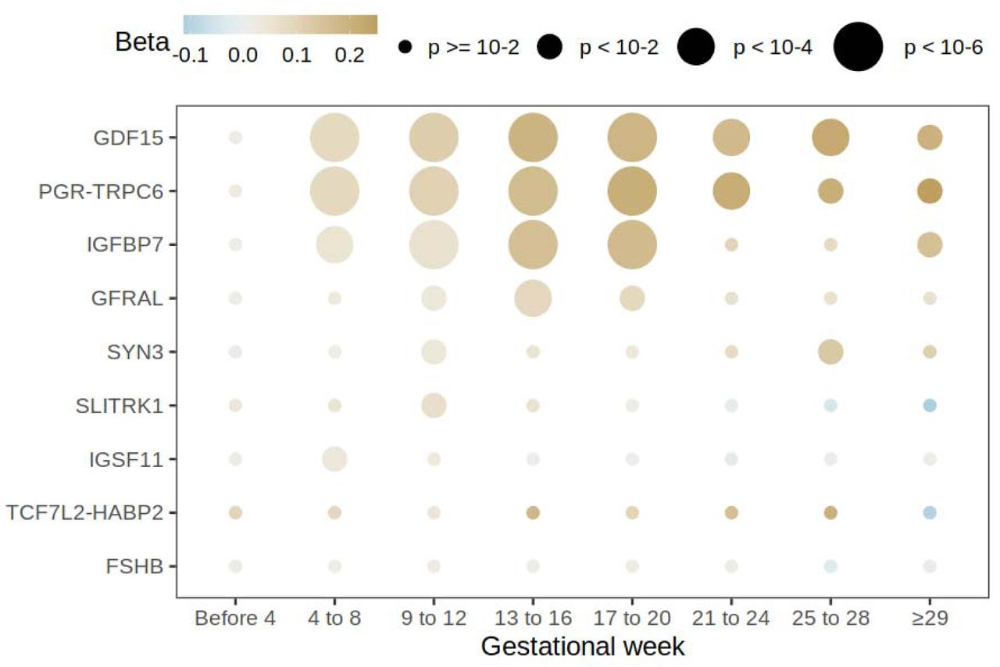
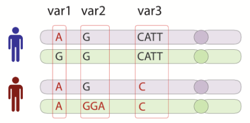
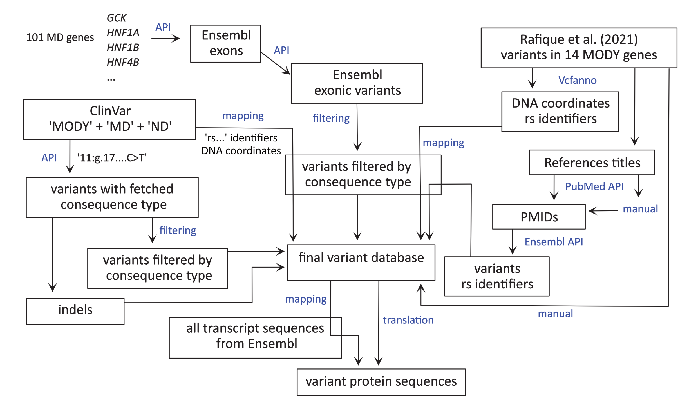
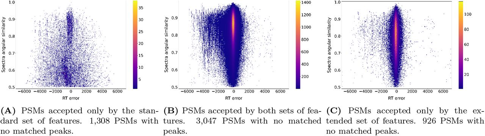
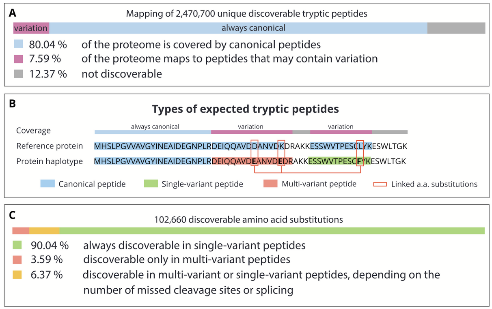
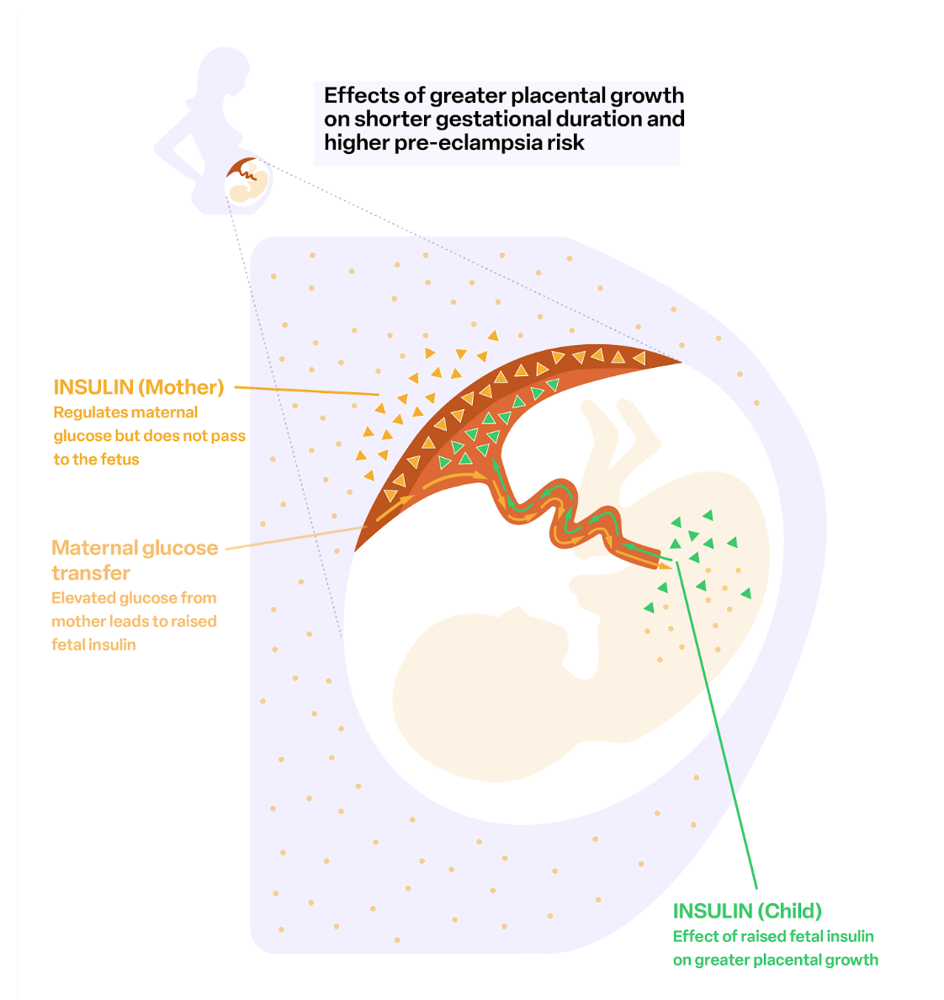
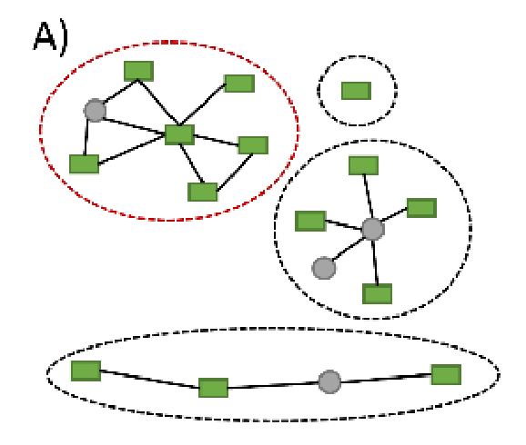
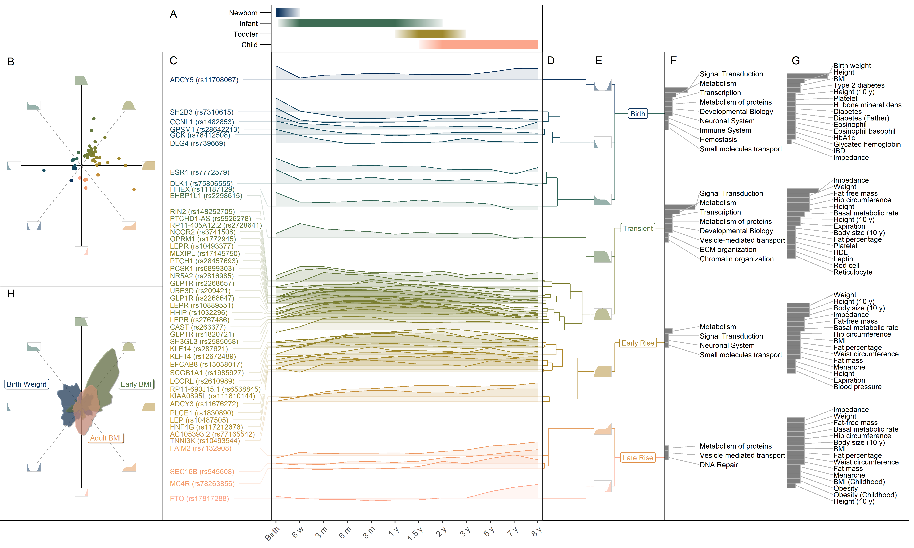
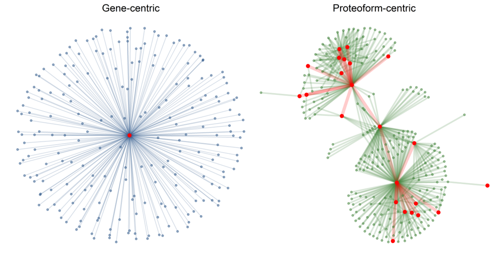

Publications
================
Marc Vaudel
2019-08-01

with the submission This repository lists the scientific publications
co-authored by [Marc Vaudel](https://www.uib.no/en/persons/Marc.Vaudel)
as of 25.06.2025.

- [ORCID: 0000-0003-1179-9578](https://orcid.org/0000-0003-1179-9578)
- [OpenAlex](https://openalex.org/works?page=1&filter=authorships.author.id%3AA5037607788&sort=cited_by_count%3Adesc&group_by=publication_year,type)
- [Google
  Scholar](https://scholar.google.com/citations?user=JTK8FTkAAAAJ)

<br>

> <sup>1</sup> shared first, <sup>\$</sup> correspondence, <sup>†</sup>
> shared last.

<br>

## Ten highlighted recent publications

1.  Kentistou KA, Sundfjord J, Karimi R, Kaisinger LR, Hofmeister RJ,
    Lupu AE, Fragoso-Bargas N, Zhao Y, Tadrass JA, Dowsett GK, Lockhart
    S, Bruening JC, Liu J, Davitte AJ, Clement L, Havdahl A, Andreassen
    OA, Bratland E, Lam BYH, O’Rahilly S, Yeo GSH, Njølstad PR, Kutalik
    Z, Day FR<sup>†</sup>, **Vaudel M**<sup>†</sup>, Perry
    JRB<sup>†</sup>, Ong KK<sup>†</sup>, Johansson S<sup>†,\$</sup>.
    *The role of common and rare genetic variation on adiposity across
    childhood*, preprint.
    \[[Preprint](https://doi.org/10.1101/2025.05.13.25327505)\]

<table>
<tr>
<td width="150">
<p>

</p>
</td>
<td>
<p style="font-size:10px;">
<i>A multi-phenotypes analysis of the genetics of childhood
adiposity.</i>
</p>
</td>
</tr>
</table>

<br>

2.  Fejzo M<sup>†,\$</sup>, Wang X, Zöllner J, Pujol-Gualdo N, Laisk T;
    Estonian Biobank Research Team; Finer S, van Heel DA; Genes & Health
    Research Team; Brumpton B, Bhatta L, Hveem K, Jasper EA, Velez
    Edwards DR, Hellwege JN, Edwards T, Jarvik GP, Luo Y, Khan A,
    MacGibbon K, Gao Y, Ge G, Averbukh I, Soon E, Angelo M, Magnus P,
    Johansson S, Njølstad PR, **Vaudel M**<sup>†</sup>, Shu
    C<sup>†</sup>, Mancuso N<sup>†</sup>. *Multi-ancestry GWAS of severe
    pregnancy nausea and vomiting identifies risk loci associated with
    appetite, insulin signaling, and brain plasticity*, preprint.
    \[[Preprint](https://doi.org/10.1101/2024.11.19.24317559)\]

<table>
<tr>
<td width="150">
<p>

</p>
</td>
<td>
<p style="font-size:10px;">
<i>Our latest meta-analysis of the genetics of nausea and vomiting
during pregnancy. We confirm the association with GDF15 in multiple
cohorts and link to health consequences during pregnancy.</i>
</p>
</td>
</tr>
</table>

<br>

3.  Vašíček J, Kuznetsova KG, Skiadopoulou D, Njølstad PR, Johansson S,
    Bruckner S<sup>†</sup>, Käll L<sup>†</sup>, **Vaudel
    M**<sup>†,\$</sup>. *ProHap enables proteomic database generation
    accounting for population diversity*, Nature Methods, 2025.
    \[[PubMed id
    39653819](https://www.ncbi.nlm.nih.gov/pubmed/39653819)\] \[[doi:
    10.1038/s41592-024-02506-0](https://doi.org/10.1038/s41592-024-02506-0)\]
    \[No Open Access found [Request a
    reprint](mailto:marc.vaudel@uib.no)\]

<table>
<tr>
<td width="150">
<p>

</p>
</td>
<td>
<p style="font-size:10px;">
<i>ProHap enables the creation of protein sequence databases from
reference phased haplotypes. The tool can be used on public or private
reference panels to build protein sequence databases that reflect the
sequence diversity of a study population. Along with the tool, we
provide protein sequences derived from the common haplotypes of the
thousand genomes redily usable for proteomic studies:
<a href="https://doi.org/10.5281/zenodo.10149278">doi
10.5281/zenodo.10149278</a>.</i>
</p>
</td>
</tr>
</table>

<br>

4.  Kuznetsova
    KG<sup>$</sup>, Vašíček J, Skiadopoulou D, Molnes J, Udler M, Johansson S, Njølstad PR, Manning A<sup>†</sup>, **Vaudel M**<sup>†,$</sup>.
    *A systematic mapping of the genomic and proteomic variation
    associated with monogenic diabetes*, Plos One, 2024. \[[PubMed id
    38635808](https://www.ncbi.nlm.nih.gov/pubmed/38635808)\] \[[doi:
    10.1371/journal.pone.0300350](https://doi.org/10.1371/journal.pone.0300350)\]
    \[[pdf](https://doi.org/10.1371/journal.pone.0300350)\]

<table>
<tr>
<td width="150">
<p>

</p>
</td>
<td>
<p style="font-size:10px;">
<i>A pipeline that maps, curates, and consolidates the variants
associated with monogenic diabetes and translate their consequences to
the protein level onto common haplotypes. We use this pipeline to design
custom proteomics database and mine for variant peptides in the
Norwegian diabetes registries. The pipeline can be used for other
diseases.</i>
</p>
</td>
</tr>
</table>

<br>

5.  Skiadopoulou D, Vašíček J, Kuznetsova KG, Käll L<sup>†</sup>,
    **Vaudel M**<sup>†,\$</sup>. *Retention time and fragmentation
    predictors increase confidence in variant peptide identification*,
    Journal of Proteome Research, 2023. \[[PubMed id
    37656829](https://www.ncbi.nlm.nih.gov/pubmed/37656829)\] \[[doi:
    10.1021/acs.jproteome.3c00243](https://doi.org/10.1021/acs.jproteome.3c00243)\]
    \[[pdf](https://pubs.acs.org/doi/pdf/10.1021/acs.jproteome.3c00243)\]

<table>
<tr>
<td width="150">
<p>

</p>
</td>
<td>
<p style="font-size:10px;">
<i>We demonstrate that common variation can be included without
affecting the identification rate. We further show how retention time
and fragmentation predictors can be used to help the machine
learning-based Percolator distinguish variant peptides from similar,
possibly modified, peptides.</i>
</p>
</td>
</tr>
</table>

<br>

6.  Vašíček J<sup>1</sup>, Skiadopoulou D<sup>1</sup>, Kuznetsova KG,
    Wen B, Johansson S, Njølstad PR, Bruckner S, Käll L<sup>†</sup>,
    **Vaudel M**<sup>†,\$</sup>. *Finding Haplotypic Signatures in
    Proteins*, Gigascience, 2023. \[[PubMed id
    37919975](https://www.ncbi.nlm.nih.gov/pubmed/37919975)\] \[[doi:
    10.1093/gigascience/giad093](https://doi.org/10.1093/gigascience/giad093)\]
    \[[pdf](https://academic.oup.com/gigascience/article-pdf/doi/10.1093/gigascience/giad093/52711879/giad093.pdf)\]

<table>
<tr>
<td width="150">
<p>

</p>
</td>
<td>
<p style="font-size:10px;">
<i>A study of the distribution of protein haplotypes, and whether they
can be identified by mass spectrometry. We show the prevalence of
muli-variant peptides that can be identified, and how these are
difficult to distinguish from similar peptides carrying PTMs.</i>
</p>
</td>
</tr>
</table>

<br>

7.  Beaumont RN<sup>1</sup>, Flatley C<sup>1</sup>, **Vaudel
    M**<sup>1</sup>, Xiaoping W, Chen J, Moen GH, Skotte L, Helgeland Ø,
    Sole-Navais P, Banasik K, Albiñana C, Ronkainen J, Fadista J,
    Stinson SE, Trajanoska K, Wang CA, Westergaard D, Srinivasan S,
    Sánchez-Soriano C, Bilbao JR, Allard C, Groleau M, Kuulasmaa T,
    Leirer DJ, White F, Jacques PE, Cheng H, Hao K, Andreassen OA,
    Åsvold BO, Atalay M, Bhatta L, Bouchard L, Brumpton BM, Brunak S,
    Bybjerg-Grauholm J, Ebbing C, Elliott P, Engelbrechtsen L, Erikstrup
    C, Estarlich M, Franks S, Gaillard R, Geller F, Grove J, Hougaard
    DM, Kajantie E, Morgen CS, Nohr EA, Nyegaard M, Palmer CNA, Pedersen
    OB, The Early Growth Genetics (EGG) Consortium, Rivadeneira F,
    Sebert S, Shields BM, Stoltenberg C, Surakka I, Thørner LW, Ullum H,
    Vaarasmaki M, Vilhjalmsson BJ, Willer CJ, Lakka TA, Gybel-Brask DJ,
    Bustamante M, Hansen T, Pearson ER, Reynolds R, Ostrowski SR,
    Pennell CE, Jaddoe VWV, Felix JF, Hattersley AT, Melbye M, Lawlor
    DA, Hveem K, Werge T, Nielsen HS, Magnus P, Evans DM, Jacobsson B,
    Järvelin MR, Zhang G, Hivert MF, Johansson S<sup>†</sup>, Freathy
    RM<sup>†</sup>, Feenstra B<sup>†</sup>, Njølstad PR<sup>†,\$</sup>.
    \_ *Genome-wide association study of placental weight identifies
    distinct and shared genetic influences between placental and fetal
    growth*, Nature Genetics, 2023. \[[PubMed id
    37798380](https://www.ncbi.nlm.nih.gov/pubmed/37798380)\] \[[doi:
    10.1038/s41588-023-01520-w](https://doi.org/10.1038/s41588-023-01520-w)\]
    \[[pdf](https://www.nature.com/articles/s41588-023-01520-w.pdf)\]

<table>
<tr>
<td width="150">
<p>

</p>
</td>
<td>
<p style="font-size:10px;">
<i>The first genome-wide analysis of placental weight. A multi-year
meta-analysis from the Early Growth Genetics (EGG) consortium including
the Norwegian Mother, Father and Child Cohort Study (MoBa). We provide
association results with the genomes of the children and parents, study
modes of association, the relationship with birth weight, and to other
traits.</i>
</p>
</td>
</tr>
</table>

<br>

8.  Hernández Sánchez LF, Burger B, Castro Campos RA, Johansson S,
    Njølstad PR, Barsnes H<sup>†</sup>, **Vaudel M**<sup>†,\$</sup>.
    *Extending protein interaction networks using proteoforms and small
    molecules*, Bioinformatics, 2023. \[[PubMed id
    37756698](https://www.ncbi.nlm.nih.gov/pubmed/37756698)\] \[[doi:
    10.1093/bioinformatics/btad598](https://doi.org/10.1093/bioinformatics/btad598)\]
    \[[pdf](https://academic.oup.com/bioinformatics/advance-article-pdf/doi/10.1093/bioinformatics/btad598/51770602/btad598.pdf)\]

<table>
<tr>
<td width="150">
<p>

</p>
</td>
<td>
<p style="font-size:10px;">
<i>We study how the structure of pathway-derived interaction networks
change upon the inclusion of information on proteoforms and small
molecules. We show how accounting for proteoform information allows
refining the representation of protein interactions and how small
molecules increase the connectivity of the network. But at the same time
accounting for this information can create artefacts in the topology of
the network.</i>
</p>
</td>
</tr>
</table>

<br>

9.  Helgeland Ø<sup>1</sup>, **Vaudel M**<sup>1</sup>, Sole-Navais P,
    Flatley C, Juodakis J, Bacelis J, Koløen IL, Peggy Knudsen G,
    Johansson BB, Magnus P, Reichborn Kjennerud T, Juliusson PB,
    Stoltenberg C, Holmen OL, Andreassen OA, Jacobsson B, Njølstad
    PR<sup>$</sup>, Johansson S<sup>$</sup>. *Characterization of the
    genetic architecture of BMI in infancy and early childhood reveals
    age-specific effects and implicates pathways involved in Mendelian
    obesity*, Nature Metabolism, 2022. \[[PubMed id
    35315439](https://www.ncbi.nlm.nih.gov/pubmed/35315439)\] \[[doi:
    10.1038/s42255-022-00549-1](https://doi.org/10.1038/s42255-022-00549-1)\]
    \[[pdf](http://hdl.handle.net/10852/95061)\]

<table>
<tr>
<td width="150">
<p>

</p>
</td>
<td>
<p style="font-size:10px;">
<i>Association of BMI during childhood with common variation - we
identify different trajectory clusters, time-dependent parent-of-origin
effects, and show how the performance of risk scores evolve during early
growth.</i>
</p>
</td>
</tr>
</table>

<br>

10. Hernández Sánchez LF, Burger B, Horro C, Fabregat A, Johansson S,
    Njølstad PR, Barsnes H, Hermjakob H, **Vaudel M**<sup>\$</sup>.
    *PathwayMatcher: proteoform-centric network construction enables
    fine-granularity multi-omics pathway mapping*, GigaScience, 2019.
    \[[PubMed id
    31363752](https://www.ncbi.nlm.nih.gov/pubmed/31363752)\] \[[doi:
    10.1093/gigascience/giz088](https://doi.org/10.1093/gigascience/giz088)\]
    \[[pdf](https://academic.oup.com/gigascience/article-pdf/8/8/giz088/29020604/giz088.pdf)\]

<table>
<tr>
<td width="150">
<p>

</p>
</td>
<td>
<p style="font-size:10px;">
<i>PathwayMatcher can build biological networks of different levels of
granularity using the Reactome pathway database, and map different types
of omics data to it. Notably, it can build a network to the level of
proteoforms, where genes and proteins are separated according to their
post-translational state. Hence, interactions are more specific, and
interactions between different forms of the same proteins become visible
as connections between different nodes, thus providing a new dimension
to study biological networks.</i>
</p>
</td>
</tr>
</table>

<br>

## Research Articles

1.  Ytterberg
    K<sup>$</sup>, Sundelin H, Juodakis J, **Vaudel M**, Corfield EC, Andreassen OA, Magnus P, Havdahl A, Nilsson S, Njølstad PR, Johansson S, Jacobsson B<sup>$</sup>,
    Solé-Navais P<sup>†,\$</sup>. *Parity modifies the effect of genetic
    variants associated with gestational duration and birth weight*,
    preprint.
    \[[Preprint](https://doi.org/10.1101/2025.06.17.25329777)\]

2.  Parehk
    P<sup>$</sup>, Parker N, Pecheva D, Frei E, **Vaudel M**, Smith DM, Rigby A, Jaholkowski P, Sønderby IE, Birkenæs V, Bakken NR, Fan CC, Makowski C, Kopal J, Loughnan R, Hagler Donald J Kr, van der Meer D, Johansson S ,Njølstad PR, Jernigan TL, Thompson WK, Frei Oleksandr, Shadrin AA, Nichols TE, Andreassen OA<sup>†</sup>, Dale AM<sup>†,$</sup>.
    *FEMA-Long: Modeling unstructured covariances for discovery of
    time-dependent effects in large-scale longitudinal datasets*,
    preprint. \[[Preprint](https://doi.org/10.1101/2025.05.09.653146)\]

3.  Skiadopoulou D, Käll L, Barsnes H, Schwämmle V, **Vaudel
    M**<sup>†,\$</sup>. *A graph-based approach for modification site
    assignment in proteomics*, preprint.
    \[[Preprint](https://doi.org/10.48550/arXiv.2505.17755)\]

4.  Unger L, Larsen U, Sharmine S, Hossain MK, Legøy TA, **Vaudel M**,
    Ghila L, Chera S<sup>†,\$</sup>. *SAM: A FIJI-Based Tool for
    Semi-Automated Quantification of Cytoplasmic Expression in Cells*,
    preprint.
    \[[Preprint](https://doi.org/10.21203/rs.3.rs-6466373/v1)\]

5.  Artaza H, Priyanka Tallapragada DS, Molnes J, Lavrichenko K, Wolff
    ASB, Røyrvik EC, Skrivarhaug T, **Vaudel M**, Bratland E, Johansson
    BB, Njølstad PR, Johansson S<sup>\$</sup>. *Contribution of Rare
    Large High-Penetrance CNVs to Pediatric and MODY Diabetes in
    Norway*, preprint.
    \[[Preprint](https://doi.org/10.1101/2025.02.25.25322584)\]

6.  Kentistou KA, Sundfjord J, Karimi R, Kaisinger LR, Hofmeister RJ,
    Lupu AE, Fragoso-Bargas N, Zhao Y, Tadrass JA, Dowsett GK, Lockhart
    S, Bruening JC, Liu J, Davitte AJ, Clement L, Havdahl A, Andreassen
    OA, Bratland E, Lam BYH, O’Rahilly S, Yeo GSH, Njølstad PR, Kutalik
    Z, Day FR<sup>†</sup>, **Vaudel M**<sup>†</sup>, Perry
    JRB<sup>†</sup>, Ong KK<sup>†</sup>, Johansson S<sup>†,\$</sup>.
    *The role of common and rare genetic variation on adiposity across
    childhood*, preprint.
    \[[Preprint](https://doi.org/10.1101/2025.05.13.25327505)\]

7.  Fejzo M<sup>†,\$</sup>, Wang X, Zöllner J, Pujol-Gualdo N, Laisk T;
    Estonian Biobank Research Team; Finer S, van Heel DA; Genes & Health
    Research Team; Brumpton B, Bhatta L, Hveem K, Jasper EA, Velez
    Edwards DR, Hellwege JN, Edwards T, Jarvik GP, Luo Y, Khan A,
    MacGibbon K, Gao Y, Ge G, Averbukh I, Soon E, Angelo M, Magnus P,
    Johansson S, Njølstad PR, **Vaudel M**<sup>†</sup>, Shu
    C<sup>†</sup>, Mancuso N<sup>†</sup>. *Multi-ancestry GWAS of severe
    pregnancy nausea and vomiting identifies risk loci associated with
    appetite, insulin signaling, and brain plasticity*, preprint.
    \[[Preprint](https://doi.org/10.1101/2024.11.19.24317559)\]

8.  Hofmeister RJ, Cavinato T, Karimi R, van der Graaf A, Pajuste F-D,
    Kronberg J, Taba N, Estonian Biobank research team, Mägi R, **Vaudel
    M**, Rubinacci S, Johansson S, Milani L, Delaneau O, Kutalik Z.
    *Parent-of-Origin inference and its role in the genetic architecture
    of complex traits: evidence from ∼265,000 individuals*, preprint.
    \[[Preprint](https://doi.org/10.1101/2024.12.03.24318392)\]

9.  Vašíček J, Skiadopoulou D, Kuznetsova KG, Käll L<sup>†</sup>,
    **Vaudel M**<sup>†</sup>, Bruckner S<sup>†,\$</sup>. *ProHap
    Explorer: Visualizing Haplotypes in Proteogenomic Datasets*,
    preprint. \[[PubMed id
    40540386](https://www.ncbi.nlm.nih.gov/pubmed/40540386)\]
    \[[Preprint](https://doi.org/10.48550/arXiv.2504.06282)\] \[[doi:
    10.1109/MCG.2025.3581736](https://doi.org/10.1109/MCG.2025.3581736)\]
    \[No Open Access found [Request a
    reprint](mailto:marc.vaudel@uib.no)\]

10. Lammi V<sup>1</sup>, Nakanishi T<sup>1</sup>, Jones SE<sup>1</sup>,
    Andrews SJ, Karjalainen J, Cortés B, O’Brien HE, Fulton-Howard BE,
    Haapaniemi HH, Schmidt A, Mitchell RE, Mousas A, Mangino M,
    Huerta-Chagoya A, Sinnott-Armstrong N, Cirulli ET, **Vaudel M**,
    Kwong ASF, Maiti AK, Marttila M, Batini C, Minnai F, Dearman AR,
    Warmerdam R, Sequeros CB, Winkler TW, Jordan DM, Guare L, Vergasova
    E, Marouli E, Striano P, Zainulabid UA, Kumar A, Ahmad HF, Edahiro
    R, Azekawa S, Long COVID Host Genetics Initiative, FinnGen, DBDS
    Genomic Consortium, GEN-COVID Multicenter Study, Grzymski JJ, Ishii
    M, Okada Y, Beckmann ND, Kumari M, Wagner R, Heid IM, John C, Short
    PJ, Magnus P, Banasik K, Geller F, Franke LH, Rakitko A, Duncan EL,
    Renieri A, Tsilidis KK, de Cid R, Niavarani A, Tusié-Luna T, Verma
    SS, Davey Smith G, Timpson NJ, Daly MJ, Ganna A, Schulte EC, Brent
    Richards J, Ludwig KU, Hultström M, Zeberg
    H<sup>†,$</sup>, Ollila HM<sup>†,$</sup>. *Genome-wide Association
    Study of Long COVID*, Nature Genetics, 2025. \[[PubMed id
    40399555](https://www.ncbi.nlm.nih.gov/pubmed/40399555)\] \[[doi:
    10.1038/s41588-025-02100-w](https://doi.org/10.1038/s41588-025-02100-w)\]
    \[[pdf](https://www.nature.com/articles/s41588-025-02100-w.pdf)\]

11. Vašíček J, Kuznetsova KG, Skiadopoulou D, Njølstad PR, Johansson S,
    Bruckner S<sup>†</sup>, Käll L<sup>†</sup>, **Vaudel
    M**<sup>†,\$</sup>. *ProHap enables proteomic database generation
    accounting for population diversity*, Nature Methods, 2025.
    \[[PubMed id
    39653819](https://www.ncbi.nlm.nih.gov/pubmed/39653819)\] \[[doi:
    10.1038/s41592-024-02506-0](https://doi.org/10.1038/s41592-024-02506-0)\]
    \[No Open Access found [Request a
    reprint](mailto:marc.vaudel@uib.no)\]

12. Artaza H, Lavrichenko K, Wolff ASB, Røyrvik EC, **Vaudel M**,
    Johansson S<sup>\$</sup>. *Rare Copy Number Variant analysis in
    case-control studies using SNP Array Data: a scalable and automated
    data analysis pipeline*, BMC Bioinformatics, 2024. \[[PubMed id
    39548362](https://www.ncbi.nlm.nih.gov/pubmed/39548362)\] \[[doi:
    10.1186/s12859-024-05979-0](https://doi.org/10.1186/s12859-024-05979-0)\]
    \[[pdf](https://link.springer.com/content/pdf/10.1186/s12859-024-05979-0.pdf)\]

13. Sole-Navais
    P<sup>1,$</sup>, Juodakis J<sup>1</sup>, Ytterberg K, Xiaoping W, **Vaudel M**, Helgeland Ø, Flatley C, Geller F, Magnus P, Andreassen OA, Njolstad PR, Feenstra B, Muglia LJ, Johanson S, Jacobsson B<sup>$</sup>.
    *Genome-wide analysis of neonatal jaundice reveals a marked
    departure from adult bilirubin metabolism*, Nature
    Communications, 2024. \[[PubMed id
    39214992](https://www.ncbi.nlm.nih.gov/pubmed/39214992)\] \[[doi:
    10.1038/s41467-024-51947-w](https://doi.org/10.1038/s41467-024-51947-w)\]
    \[[pdf](https://www.nature.com/articles/s41467-024-51947-w.pdf)\]

14. Olwi DI, Kaisinger LR KG, Kentistou KA, **Vaudel M**, Stankovic S,
    Njølstad PR, Johansson S, Perry JRB, Day FR, Ong KK<sup>†,\$</sup>.
    *Likely causal effects of insulin resistance and IGF-1 bioaction on
    childhood and adult adiposity: a Mendelian randomization study *,
    International Journal of Obesity, 2024. \[[PubMed id
    39174749](https://www.ncbi.nlm.nih.gov/pubmed/39174749)\] \[[doi:
    10.1038/s41366-024-01605-4](https://doi.org/10.1038/s41366-024-01605-4)\]
    \[[pdf](https://www.nature.com/articles/s41366-024-01605-4.pdf)\]

15. Kentistou KA<sup>1</sup>, Kaisinger LR<sup>1</sup>, Stankovic S,
    **Vaudel M**, de Oliveira EM, Messina A, Walters RG, Liu X, Busch
    AS, Helgason H, Thompson DJ, Santon F, Petricek KM, Zouaghi Y,
    Huang-Doran I, Gudbjartsson DF, Bratland E, Lin K, Gardner EJ, Zhao
    Y, Jia R, Terao C, Riggan M, Bolla MK, Yazdanpanah M, Yazdanpanah N,
    Bradfield JP, Broer L, Campbell A, Chasman DI, Cousminer DL,
    Franceschini N, Franke LH, Girotto G, He C, Järvelin MR, Joshi PK,
    Kamatani Y, Karlsson R, Luan J, Lunetta KL, Mägi R, Mangino M,
    Medland SE, Meisinger C, Noordam R, Nutile T, Concas MP, Polašek O,
    Porcu E, Ring SM, Sala C, Smith AV, Tanaka T, van der Most PJ,
    Vitart V, Wang CA, Willemsen G, Zygmunt M, Ahearn TU, Andrulis IL,
    Anton-Culver H, Antoniou AC, Auer PL, Barnes CL, Beckmann MW,
    Berrington A, Bogdanova NV, Bojesen SE, Brenner H, Buring JE,
    Canzian F, Chang-Claude J, Couch FJ, Cox A, Crisponi L, Czene K,
    Daly MB, Demerath EW, Dennis J, Devilee P, Vivo I, Dörk T, Dunning
    AM, Dwek M, Eriksson JG, Fasching PA, Fernandez-Rhodes L, Ferreli L,
    Fletcher O, Gago-Dominguez M, García-Closas M, García-Sáenz JA,
    González-Neira A, Grallert H, Guénel P, Haiman CA, Hall P, Hamann U,
    Hakonarson H, Hart RJ, Hickey M, Hooning MJ, Hoppe R, Hopper JL,
    Hottenga JJ, Hu FB, Hubner H, Hunter DJ, ABCTB Investigators,
    Jernstrom H, John EM, Karasik D, Khusnutdinova EK, Kristensen VN,
    Lacey JV, Lambrechts D, Launer LJ, Lind PA, Lindblom A, Magnusson
    PKE, Mannermaa A, McCarthy mi, Meitinger T, Menni C, Michailidou K,
    Millwood IY, Milne RL, Montgomery GW, Nevanlinna H, Nolte IM, Nyholt
    DR, Obi N, O’Brien KM, Offit K, Oldehinkel AJ, Ostrowski SR, Palotie
    A, Pedersen OB, Peters A, Pianigiani G, Plaseska-Karanfilska D,
    Pouta A, Pozarickij A, Radice P, Rennert G, Rosendaal FR, Ruggiero
    D, Saloustros E, Sandler DP, Schipf S, Schmidt CO, Schmidt MK, Small
    K, Spedicati B, Stampfer M, J Stone, Tamimi RM, TerasLR, Tikkanen E,
    Turman C, Vachon CM, Wang Q, Winqvist R, Wolk A, Zemel BS, Zheng W,
    van Dijk KW, Alizadeh BZ, Bandinelli S, Boerwinkle E, Boomsma DI,
    Ciullo M, Chenevix-Trench G, Cucca F, Esko T, Gieger C, Grant SFA,
    Gudnason V, Hayward C, Kolcic I, Kraft P, Lawlor DA, Martin NG, Nohr
    EA, Pedersen NL, Pennell CE, Ridker PM, Robino A, Snieder H, Sovio
    U, Spector TD, Stockl D, Sudlow C, Timpson NJ, Toniolo D,
    Uitterlinden A, Ulivi S, VolzkeH, Wareham NJ, Widen E, Wilson JF,
    The Lifelines Cohort Study, The Danish Blood Donor study, The
    Ovarian Cancer Association Consortium, The Breast Cancer Association
    Consortium, The Biobank Japan Project, The China Kadoorie Biobank
    Collaborative Group, Pharoah PDP, Li L, Easton DF, Njølstad pr,
    Sulem P, Murabito JM, Murray A, Manousaki D, Juul A, ErikstrupC,
    Stefansson K, Horikoshi M, Chen Z, Farooqi IS, Pitteloud N,
    JohanssonS, Day FR<sup>†</sup>, Perry JRB<sup>†,\$</sup>, Ong
    KK<sup>†</sup>. *Understanding the genetic complexity of puberty
    timing across the allele frequency spectrum*, Nature Genetics, 2024.
    \[[PubMed id
    38951643](https://www.ncbi.nlm.nih.gov/pubmed/38951643)\] \[[doi:
    10.1038/s41588-024-01798-4](https://doi.org/10.1038/s41588-024-01798-4)\]
    \[[pdf](https://www.nature.com/articles/s41588-024-01798-4.pdf)\]

16. Kuznetsova
    KG<sup>$</sup>, Vašíček J, Skiadopoulou D, Molnes J, Udler M, Johansson S, Njølstad PR, Manning A<sup>†</sup>, **Vaudel M**<sup>†,$</sup>.
    *A systematic mapping of the genomic and proteomic variation
    associated with monogenic diabetes*, Plos One, 2024. \[[PubMed id
    38635808](https://www.ncbi.nlm.nih.gov/pubmed/38635808)\] \[[doi:
    10.1371/journal.pone.0300350](https://doi.org/10.1371/journal.pone.0300350)\]
    \[[pdf](https://doi.org/10.1371/journal.pone.0300350)\]

17. Jaitner A, **Vaudel M**, Tsaneva-Atanasova K, Njølstad PR, Jacobsson
    B, Bowden J, Johansson S, Freathy R<sup>\$</sup>. *Smoking during
    pregnancy and its effect on placental weight: A Mendelian
    randomization study*, BMC Pregnancy Childbirth, 2024. \[[PubMed id
    38575863](https://www.ncbi.nlm.nih.gov/pubmed/38575863)\] \[[doi:
    10.1186/s12884-024-06431-0](https://doi.org/10.1186/s12884-024-06431-0)\]
    \[[pdf](https://bmcpregnancychildbirth.biomedcentral.com/counter/pdf/10.1186/s12884-024-06431-0)\]

18. Artaza H, Eriksson D, Lavrichenko K, Aranda-Guillén M, Bratland E,
    **Vaudel M**, Knappskog P, Husebye E, Bensing S, Wolff ASB, Kämpe O,
    Røyrvik EC<sup>$</sup>, Johansson S<sup>$</sup>. *Rare copy number
    variation in autoimmune Addison’s disease*, Frontiers in
    Immunology, 2024. \[[PubMed id
    38562931](https://www.ncbi.nlm.nih.gov/pubmed/38562931)\] \[[doi:
    10.3389/fimmu.2024.1374499](https://doi.org/10.3389/fimmu.2024.1374499)\]
    \[[pdf](https://doi.org/10.3389/fimmu.2024.1374499)\]

19. Vašíček J<sup>1</sup>, Skiadopoulou D<sup>1</sup>, Kuznetsova KG,
    Wen B, Johansson S, Njølstad PR, Bruckner S, Käll L<sup>†</sup>,
    **Vaudel M**<sup>†,\$</sup>. *Finding Haplotypic Signatures in
    Proteins*, GigaScience, 2023. \[[PubMed id
    37919975](https://www.ncbi.nlm.nih.gov/pubmed/37919975)\] \[[doi:
    10.1093/gigascience/giad093](https://doi.org/10.1093/gigascience/giad093)\]
    \[[pdf](https://academic.oup.com/gigascience/article-pdf/doi/10.1093/gigascience/giad093/52711879/giad093.pdf)\]

20. Beaumont RN<sup>1</sup>, Flatley C<sup>1</sup>, **Vaudel
    M**<sup>1</sup>, Xiaoping W, Chen J, Moen GH, Skotte L, Helgeland Ø,
    Sole-Navais P, Banasik K, Albiñana C, Ronkainen J, Fadista J,
    Stinson SE, Trajanoska K, Wang CA, Westergaard D, Srinivasan S,
    Sánchez-Soriano C, Bilbao JR, Allard C, Groleau M, Kuulasmaa T,
    Leirer DJ, White F, Jacques PE, Cheng H, Hao K, Andreassen OA,
    Åsvold BO, Atalay M, Bhatta L, Bouchard L, Brumpton BM, Brunak S,
    Bybjerg-Grauholm J, Ebbing C, Elliott P, Engelbrechtsen L, Erikstrup
    C, Estarlich M, Franks S, Gaillard R, Geller F, Grove J, Hougaard
    DM, Kajantie E, Morgen CS, Nohr EA, Nyegaard M, Palmer CNA, Pedersen
    OB, The Early Growth Genetics (EGG) Consortium, Rivadeneira F,
    Sebert S, Shields BM, Stoltenberg C, Surakka I, Thørner LW, Ullum H,
    Vaarasmaki M, Vilhjalmsson BJ, Willer CJ, Lakka TA, Gybel-Brask DJ,
    Bustamante M, Hansen T, Pearson ER, Reynolds R, Ostrowski SR,
    Pennell CE, Jaddoe VWV, Felix JF, Hattersley AT, Melbye M, Lawlor
    DA, Hveem K, Werge T, Nielsen HS, Magnus P, Evans DM, Jacobsson B,
    Järvelin MR, Zhang G, Hivert MF, Johansson S<sup>†</sup>, Freathy
    RM<sup>†</sup>, Feenstra B<sup>†</sup>, Njølstad PR<sup>†,\$</sup>.
    *Genome-wide association study of placental weight identifies
    distinct and shared genetic influences between placental and fetal
    growth*, Nature Genetics, 2023. \[[PubMed id
    37798380](https://www.ncbi.nlm.nih.gov/pubmed/37798380)\] \[[doi:
    10.1038/s41588-023-01520-w](https://doi.org/10.1038/s41588-023-01520-w)\]
    \[[pdf](https://www.nature.com/articles/s41588-023-01520-w.pdf)\]

21. Hernández Sánchez LF, Burger B, Castro Campos RA, Johansson S,
    Njølstad PR, Barsnes H<sup>†</sup>, **Vaudel M**<sup>†,\$</sup>.
    *Extending protein interaction networks using proteoforms and small
    molecules*, Bioinformatics, 2023. \[[PubMed id
    37756698](https://www.ncbi.nlm.nih.gov/pubmed/37756698)\] \[[doi:
    10.1093/bioinformatics/btad598](https://doi.org/10.1093/bioinformatics/btad598)\]
    \[[pdf](https://academic.oup.com/bioinformatics/advance-article-pdf/doi/10.1093/bioinformatics/btad598/51770602/btad598.pdf)\]

22. Skiadopoulou D, Vašíček J, Kuznetsova KG, Käll L<sup>†</sup>,
    **Vaudel M**<sup>†,\$</sup>. *Retention time and fragmentation
    predictors increase confidence in variant peptide identification*,
    Journal of Proteome Research, 2023. \[[PubMed id
    37656829](https://www.ncbi.nlm.nih.gov/pubmed/37656829)\] \[[doi:
    10.1021/acs.jproteome.3c00243](https://doi.org/10.1021/acs.jproteome.3c00243)\]
    \[[pdf](https://pubs.acs.org/doi/pdf/10.1021/acs.jproteome.3c00243)\]

23. Sole-Navais
    P<sup>$</sup>, Flatley C, Steinthorsdottir V, **Vaudel M**, Chen J, Laisk T, LaBella AL, Westergaard D, Bacelis J, Juodakis J, Brumpton B, Skotte L, Borges MC, Helgeland Ø, Mahajan A, Wielscher M, Lin F, Briggs C, Wang CA, Moen GH, Beaumont RN, Bradfield JP, Thorleifsson G, Elvestad Gabrielsen M, Rye Ostrowski S, Modzelewska D, Estonian Biobank Research Team, Nohr EA, Hypponen E, Srivastava A, Talbot O, Allard C, Williams SM, Menon R, Shields BM, Sveinbjornsson G, Xu H, Danish Blood Donor Study Genomic Consortium, Early Growth Genetics Consortium, Melbye M, William L Jr, Bouchard L, Oken E, Birger Pedersen O, Gudbjartsson DF, Erikstrup C, Sorensen E, Lie RT, Teramo K, Hallman M, Juliusdottir T, Hakonarson H, Hattersley AT, Sletner L, Merialdi M, Rifas-Shiman S, Steingrimsdottir T, Scholtens D, Power C, West J, Nyegaard M, Capra JA, Skogholt AH, Magnus P, Andreassen OA, Thorsteinsdottir U, Grant SFA, Qvigstad E, Pennell CE, Hivert MF, Hayes GM, Jarvelin MR, McCarthy MI, Lawlor DA, Lawlor DA, Nielsen HS, Magi R, Rokas A, Hveem K, Stefansson K, Feenstra B, Njolstad PR, Muglia LJ, Freathy RM, Johanson S, Zhang G<sup>†</sup>, Jacobsson B<sup>†,$</sup>.
    *Genetic effects on the timing of parturition and links to fetal
    birth weight*, Nature Genetics, 2023. \[[PubMed id
    37012456](https://www.ncbi.nlm.nih.gov/pubmed/37012456)\] \[[doi:
    10.1038/s41588-023-01343-9](https://doi.org/10.1038/s41588-023-01343-9)\]
    \[[pdf](https://www.nature.com/articles/s41588-023-01343-9.pdf)\]

24. Burger B<sup>\$</sup>, **Vaudel M**, Barsnes H. *Automated splitting
    into batches for observational biomedical studies with sequential
    processing*, Biostatistics, 2022. \[[PubMed id
    35536588](https://www.ncbi.nlm.nih.gov/pubmed/35536588)\] \[[doi:
    10.1093/biostatistics/kxac014](https://doi.org/10.1093/biostatistics/kxac014)\]
    \[[pdf](https://academic.oup.com/biostatistics/article-pdf/24/4/1031/52215311/kxac014.pdf)\]

25. Helgeland Ø<sup>1</sup>, **Vaudel M**<sup>1</sup>, Sole-Navais P,
    Flatley C, Juodakis J, Bacelis J, Koløen IL, Knudsen GP, Johansson
    BB, Magnus P, Kjennerud TR, Juliusson PB, Stoltenberg C, Holmen OL,
    Andreassen OA, Jacobsson B, Njølstad
    PR<sup>$</sup>, Johansson S<sup>$</sup>. *Characterization of the
    genetic architecture of infant and early childhood body mass index*,
    Nature Metabolism, 2022. \[[PubMed id
    35315439](https://www.ncbi.nlm.nih.gov/pubmed/35315439)\] \[[doi:
    10.1038/s42255-022-00549-1](https://doi.org/10.1038/s42255-022-00549-1)\]
    \[[pdf](http://hdl.handle.net/10852/95061)\]

26. Carrasco M, Wang C, Søviknes AM, Bjørlykke Y, Abadpour S, Paulo JA,
    Tjora E, Njølstad P, Ghabayen J, Nermoen I, Lyssenko V, Chera S,
    Ghila LM, **Vaudel M**, Scholz H, Ræder H<sup>\$</sup>. *Spatial
    Environment Affects HNF4A Mutation-Specific Proteome Signatures and
    Cellular Morphology in hiPSC-Derived β-Like Cells*, Diabetes, 2022.
    \[[PubMed id
    35043148](https://www.ncbi.nlm.nih.gov/pubmed/35043148)\] \[[doi:
    10.2337/db20-1279](https://doi.org/10.2337/db20-1279)\]
    \[[pdf](https://diabetesjournals.org/diabetes/article-pdf/71/4/862/671742/db201279.pdf)\]

27. Flatley C<sup>\$</sup>, Sole-Navais P, **Vaudel M**, Helgeland Ø,
    Modzelewska D, Johansson S, Jacobsson B<sup>†</sup>, Njølstad
    P<sup>†</sup>. *Placental weight centiles adjusted for age, parity
    and fetal sex*, Placenta, 2022. \[[PubMed id
    34773745](https://www.ncbi.nlm.nih.gov/pubmed/34773745)\] \[[doi:
    10.1016/j.placenta.2021.10.011](https://doi.org/10.1016/j.placenta.2021.10.011)\]
    \[[pdf](https://doi.org/10.1016/j.placenta.2021.10.011)\]

28. Farag YM, Horro C, **Vaudel M**, Barsnes H<sup>\$</sup>.
    *PeptideShaker Online: A User-Friendly Web-Based Framework for the
    Identification of Mass Spectrometry-Based Proteomics Data*, Journal
    of Proteome Research, 2021. \[[PubMed id
    34709836](https://www.ncbi.nlm.nih.gov/pubmed/34709836)\] \[[doi:
    10.1021/acs.jproteome.1c00678](https://doi.org/10.1021/acs.jproteome.1c00678)\]
    \[[pdf](https://pubs.acs.org/doi/pdf/10.1021/acs.jproteome.1c00678)\]

29. Dai C, Füllgrabe A, Pfeuffer J, Solovyeva EM, Deng J, Moreno P,
    Kamatchinathan S, Kundu DJ, George N, Fexova S, Grüning B, Föll MC,
    Griss J, **Vaudel M**, Audain E, Locard-Paulet M, Turewicz M,
    Eisenacher M, Uszkoreit J, Van Den Bossche T, Schwämmle V, Webel H,
    Schulze S, Bouyssié D, Jayaram S, Duggineni VK, Samaras P, Wilhelm
    M, Choi M, Wang M, Kohlbacher O, Brazma A, Papatheodorou I, Bandeira
    N, Deutsch EW, Vizcaíno JA, Bai
    M<sup>$</sup>, Sachsenberg T<sup>$</sup>, Levitsky
    LI<sup>$</sup>, Perez-Riverol Y<sup>$</sup>. *A proteomics sample
    metadata representation for multiomics integration and big data
    analysis*, Nature Communications, 2021. \[[PubMed id
    34615866](https://www.ncbi.nlm.nih.gov/pubmed/34615866)\] \[[doi:
    10.1038/s41467-021-26111-3](https://doi.org/10.1038/s41467-021-26111-3)\]
    \[[pdf](https://www.nature.com/articles/s41467-021-26111-3.pdf)\]

30. Eriksson D<sup>1</sup>, Røyrvik EC<sup>1</sup>, Aranda-Guillén
    M<sup>1</sup>, Berger AH, Landegren N, Artaza H, Hallgren Å, Grytaas
    MA, Ström S, Bratland E, Botusan IR, Oftedal BE, Breivik L, **Vaudel
    M**, Helgeland Ø, Falorni A, Jørgensen AP, Hulting A-L, Svartberg J,
    Ekwall O, Fougner KJ, Wahlberg J, Nedrebø BG, Dahlqvist P, The
    Norwegian Addison Registry Study Group, The Swedish Addison Registry
    Study Group, Knappskog PM, Bøe AS, Bensing S, Johansson
    S<sup>†</sup>, Kämpe O<sup>†,$</sup>, Husebye ES<sup>†,$</sup>.
    *GWAS for autoimmune Addison’s disease identifies multiple risk loci
    and highlights AIRE in disease susceptibility*, Nature
    Communications, 2021. \[[PubMed id
    33574239](https://www.ncbi.nlm.nih.gov/pubmed/33574239)\] \[[doi:
    10.1038/s41467-021-21015-8](https://doi.org/10.1038/s41467-021-21015-8)\]
    \[[pdf](https://www.nature.com/articles/s41467-021-21015-8.pdf)\]

31. Sole-Navais P<sup>\$</sup>, Bacelis J, Helgeland Ø, Modzelewska D,
    **Vaudel M**, Flatley C, Andreassen O, Njølstad PR, Muglia LJ,
    Johansson S, Zhang G, Jacobsson B. *Autozygosity mapping and
    time-to-spontaneous delivery in Norwegian parent-offspring trios*,
    Human Molecular Genetics, 2020. \[[PubMed id
    33291140](https://www.ncbi.nlm.nih.gov/pubmed/33291140)\] \[[doi:
    10.1093/hmg/ddaa255](https://doi.org/10.1093/hmg/ddaa255)\]
    \[[pdf](https://academic.oup.com/hmg/article-pdf/29/23/3845/36194738/ddaa255.pdf)\]

32. Gupta MK, Vethe H, Softic S, Rao TN, Wagh V, Shirakawa J, Barsnes H,
    **Vaudel M**, Takatani T, Kahraman S, Sakaguchi M, Martinez R, Hu J,
    Bjørlykke Y, Raeder H, Kulkarni RN<sup>\$</sup>. *Leptin Receptor
    Signaling Regulates Protein Synthesis Pathways and Neuronal
    Differentiation in Pluripotent Stem Cells*, Stem Cell Reports, 2020.
    \[[PubMed id
    33125875](https://www.ncbi.nlm.nih.gov/pubmed/33125875)\] \[[doi:
    10.1016/j.stemcr.2020.10.001](https://doi.org/10.1016/j.stemcr.2020.10.001)\]
    \[[pdf](http://www.cell.com/article/S2213671120303866/pdf)\]

33. Vogelezang S<sup>1</sup>, Bradfield JP<sup>1</sup>, Ahluwalia TS,
    Curtin JA, Lakka TA, Grarup N, Scholz M, van der Most PJ, Monnereau
    C, Stergiakouli E, Heiskala A, Horikoshi M, Fedko IO, Vilor-Tejedor
    N, Cousminer DL, Standl M, Wang CA, Viikari J, Geller F, Íñiguez C,
    Pitkänen N, Chesi A, Bacelis J, Yengo L, Torrent M, Ntalla I,
    Helgeland Ø, Selzam S, Vonk JM, Zafarmand MH, Heude B, Farooqi IS,
    Alyass A, Beaumont RN, Have CT, Rzehak P, Bilbao JR, Schnurr TM,
    Barroso I, Bønnelykke K, Beilin LJ, Carstensen L, Charles MA, Chawes
    B, Clément K, Closa-Monasterolo R, Custovic A, Eriksson JG,
    Escribano J, Groen-Blokhuis M, Grote V, Gruszfeld D, Hakonarson H,
    Hansen T, Hattersley AT, Hollensted M, Hottenga JJ, Hyppönen E,
    Johansson S, Joro R, Kähönen M, Karhunen V, Kiess W, Knight BA,
    Koletzko B, Kühnapfel A, Landgraf K, Langhendries JP, Lehtimäki T,
    Leinonen JT, Li A, Lindi V, Lowry E, Bustamante M, Medina-Gomez C,
    Melbye M, Michaelsen KF, Morgen CS, Mori TA, Nielsen TRH, Niinikoski
    H, Oldehinkel AJ, Pahkala K, Panoutsopoulou K, Pedersen O, Pennell
    CE, Power C, Reijneveld SA, Rivadeneira F, Simpson A, Sly PD,
    Stokholm J, Teo KK, Thiering E, Timpson NJ, Uitterlinden AG, van
    Beijsterveldt CEM, van Schaik BDC, **Vaudel M**, Verduci E, Vinding
    RK, Vogel M, Zeggini E, Sebert S, Lind MV, Brown CD, Santa-Marina L,
    Reischl E, Frithioff-Bøjsøe C, Meyre D, Wheeler E, Ong K, Nohr EA,
    Vrijkotte TGM, Koppelman GH, Plomin R, Njølstad PR, Dedoussis GD,
    Froguel P, Sørensen TIA, Jacobsson B, Freathy RM, Zemel BS,
    Raitakari O, Vrijheid M, Feenstra B, Lyytikäinen LP, Snieder H,
    Kirsten H, Holt PG, Heinrich J, Widén E, Sunyer J, Boomsma DI,
    Järvelin MR, Körner A, Davey Smith G, Holm JC, Atalay M, Murray C,
    Bisgaard H, McCarthy MI; Early Growth Genetics Consortium, Jaddoe
    VWV<sup>†</sup>, Grant SFA<sup>†</sup>, Felix JF<sup>†,\$</sup>.
    *Novel loci for childhood body mass index and shared heritability
    with adult cardiometabolic traits*, PLoS Genetics, 2020. \[[PubMed
    id 33045005](https://www.ncbi.nlm.nih.gov/pubmed/33045005)\] \[[doi:
    10.1371/journal.pgen.1008718](https://doi.org/10.1371/journal.pgen.1008718)\]
    \[[pdf](https://journals.plos.org/plosgenetics/article/file?id=10.1371/journal.pgen.1008718&type=printable)\]

34. Smajlagić D, Lavrichenko K, Berland S, Helgeland Ø, Knudsen GP,
    **Vaudel M**, Haavik J, Knappskog PM, Njølstad PR, Houge G,
    Johansson S<sup>\$</sup>. *Population prevalence and inheritance
    pattern of recurrent CNVs associated with neurodevelopmental
    disorders in 12,252 newborns and their parents*, European Journal of
    Human Genetics, 2020. \[[PubMed id
    32778765](https://www.ncbi.nlm.nih.gov/pubmed/32778765)\] \[[doi:
    10.1038/s41431-020-00707-7](https://doi.org/10.1038/s41431-020-00707-7)\]
    \[[pdf](https://www.nature.com/articles/s41431-020-00707-7.pdf)\]

35. Aasebø E, Berven FS, Bartaula-Brevik S, Stokowy T, Hovland R,
    **Vaudel M**, Døskeland SO, McCormack E, Batth TS, Olsen JV,
    Bruserud Ø, Selheim F<sup>†</sup>, Hernandez-Valladares
    M<sup>†,\$</sup>. *Proteome and Phosphoproteome Changes Associated
    with Prognosis in Acute Myeloid Leukemia*, Cancers, 2020. \[[PubMed
    id 32192169](https://www.ncbi.nlm.nih.gov/pubmed/32192169)\] \[[doi:
    10.3390/cancers12030709](https://doi.org/10.3390/cancers12030709)\]
    \[[pdf](https://www.mdpi.com/2072-6694/12/3/709/pdf?version=1584496962)\]

36. Loo LSW, Vethe H, Soetedjo AAP, Paulo JA, Jasmen J, Jackson N,
    Bjørlykke Y, Valdez IA, **Vaudel M**, Barsnes H, Gygi SP, Ræder H,
    Teo AKK<sup>$</sup>, Kulkarni RN<sup>$</sup>. *Dynamic proteome
    profiling of human pluripotent stem cell-derived pancreatic
    progenitors*, Stem Cells, 2019. \[[PubMed id
    31828876](https://www.ncbi.nlm.nih.gov/pubmed/31828876)\] \[[doi:
    10.1002/stem.3135](https://doi.org/10.1002/stem.3135)\]
    \[[pdf](https://www.ncbi.nlm.nih.gov/pmc/articles/7289403)\]

37. Bjørlykke Y, Søviknes AM, Hoareau L, Vethe H, Mathisen AF, Chera S,
    **Vaudel M**, Ghila L, Ræder H<sup>\$</sup>. *Reprogrammed cells
    display distinct proteomic signatures associated with colony
    morphology variability*, Stem Cells International, 2019. \[[PubMed
    id 31827534](https://www.ncbi.nlm.nih.gov/pubmed/31827534)\] \[[doi:
    10.1155/2019/8036035](https://doi.org/10.1155/2019/8036035)\]
    \[[pdf](https://downloads.hindawi.com/journals/sci/2019/8036035.pdf)\]

38. Qiao Z, Zheng J, Helgeland Ø, **Vaudel M**, Johansson S, Njølstad
    PR, Davey Smith G, Warrington NM, Evans D<sup>\$</sup>. *Introducing
    M-GCTA a software package to estimate maternal (or paternal) genetic
    effects on offspring phenotypes*, Behavior Genetics, 2019. \[[PubMed
    id 31493278](https://www.ncbi.nlm.nih.gov/pubmed/31493278)\] \[[doi:
    10.1007/s10519-019-09969-4](https://doi.org/10.1007/s10519-019-09969-4)\]
    \[[pdf](https://research-information.bris.ac.uk/ws/files/207903720/M_GCTA_R1.pdf)\]

39. Hernández Sánchez LF, Burger B, Horro C, Fabregat A, Johansson S,
    Njølstad PR, Barsnes H, Hermjakob H, **Vaudel M**<sup>\$</sup>.
    *PathwayMatcher: proteoform-centric network construction enables
    fine-granularity multi-omics pathway mapping*, GigaScience, 2019.
    \[[PubMed id
    31363752](https://www.ncbi.nlm.nih.gov/pubmed/31363752)\] \[[doi:
    10.1093/gigascience/giz088](https://doi.org/10.1093/gigascience/giz088)\]
    \[[pdf](https://academic.oup.com/gigascience/article-pdf/8/8/giz088/29020604/giz088.pdf)\]

40. Helgeland Ø, **Vaudel M**, Juliusson PB, Lingaas Holmen O, Juodakis
    J, Bacelis J, Jacobsson B, Lindekleiv H, Hveem K, Lie RT, Knudsen
    GP, Stoltenberg C, Magnus P, Sagen JV, Molven A, Johansson
    S<sup>†$</sup>, Njølstad PR<sup>†$</sup>. *Genome-wide association
    study reveals a dynamic role of common genetic variation in infant
    and early childhood growth*, Nature Communications, 2019. \[[PubMed
    id 31575865](https://www.ncbi.nlm.nih.gov/pubmed/31575865)\]
    \[[Preprint](https://doi.org/10.1101/478255)\] \[[doi:
    10.1038/s41467-019-12308-0](https://doi.org/10.1038/s41467-019-12308-0)\]
    \[[pdf](https://www.nature.com/articles/s41467-019-12308-0.pdf)\]

41. Bradfield JP<sup>1</sup>, Vogelezang S<sup>1</sup>, Felix JF, Chesi
    A, Helgeland Ø, Horikoshi M, Karhunen V, Lowry E, Cousminer DL,
    Ahluwalia TS, Thiering E, Boh ET, Zafarmand MH, Vilor-Tejedor N,
    Wang CA, Joro R, Chen Z, Gauderman WJ, Pitkänen N, Parra EJ,
    Fernandez-Rhodes L, Alyass A, Monnereau C, Curtin JA, Have CT,
    McCormack SE, Hollensted M, Frithioff-Bøjsøe C, Valladares-Salgado
    A, Peralta-Romero J, Teo YY, Standl M, Leinonen JT, Holm JC, Peters
    T, Vioque J, Vrijheid M, Simpson A, Custovic A, **Vaudel M**,
    Canouil M, Lindi V, Atalay M, Kähönen M, Raitakari OT, van Schaik
    BDC, Berkowitz RI, Cole SA, Voruganti VS, Wang Y, Highland HM,
    Comuzzie AG, Butte NF, Justice AE, Gahagan S, Blanco E, Lehtimäki T,
    Lakka TA, Hebebrand J, Bonnefond A, Grarup N, Froguel P, Lyytikäinen
    LP, Cruz M, Kobes S, Hanson RL, Zemel BS, Hinney A, Teo KK, Meyre D,
    North KE, Gilliland FD, Bisgaard H, Bustamante M, Bonnelykke K,
    Pennell CE, Rivadeneira F, Uitterlinden AG, Baier LJ, Vrijkotte TGM,
    Heinrich J, Sørensen TIA, Saw SM, Pedersen O, Hansen T, Eriksson J,
    Widén E, McCarthy MI, Njølstad PR, Power C, Hyppönen E, Sebert S,
    Brown CD, Järvelin MR, Timpson NJ, Johansson S, Hakonarson H, Jaddoe
    VWV<sup>†</sup>; Early Growth Genetics Consortium, Grant
    SFA<sup>†,\$</sup>. *A Trans-ancestral Meta-Analysis of Genome-Wide
    Association Studies Reveals Loci Associated with Childhood Obesity*,
    Human Molecular Genetics, 2019. \[[PubMed id
    31504550](https://www.ncbi.nlm.nih.gov/pubmed/31504550)\] \[[doi:
    10.1093/hmg/ddz161](https://doi.org/10.1093/hmg/ddz161)\]
    \[[pdf](http://hdl.handle.net/10138/319734)\]

42. Warrington NM<sup>1</sup>, Beaumont RN<sup>1</sup>, Horikoshi
    M<sup>1</sup>, Day FR<sup>1</sup>, Helgeland Ø<sup>1</sup>, Laurin
    C, Bacelis J, Peng S, Hao K, Feenstra B, Wood AR, Mahajan A, Tyrrell
    J, Robertson NR, Rayner NW, Qiao Z, Moen GH, **Vaudel M**, Marsit
    CJ, Chen J, Nodzenski M, Schnurr TM, Zafarmand MH, Bradfield JP,
    Grarup N, Kooijman MN, Li-Gao R, Geller F, Ahluwalia TS, Paternoster
    L, Rueedi R, Huikari V, Hottenga JJ, Lyytikäinen LP, Cavadino A,
    Metrustry S, Cousminer DL, Wu Y, Thiering E, Wang CA, Have CT,
    Vilor-Tejedor N, Joshi PK, Painter JN, Ntalla I, Myhre R, Pitkänen
    N, van Leeuwen EM, Joro R, Lagou V, Richmond RC, Espinosa A, Barton
    SJ, Inskip HM, Holloway JW, Santa-Marina L, Estivill X, Ang W, Marsh
    JA, Reichetzeder C, Marullo L, Hocher B, Lunetta KL, Murabito JM,
    Relton CL, Kogevinas M, Chatzi L, Allard C, Bouchard L, Hivert MF,
    Zhang G, Muglia LJ, Heikkinen J; EGG Consortium, Morgen CS, van
    Kampen AHC, van Schaik BDC, Mentch FD, Langenberg C, Luan J, Scott
    RA, Zhao JH, Hemani G, Ring SM, Bennett AJ, Gaulton KJ,
    Fernandez-Tajes J, van Zuydam NR, Medina-Gomez C, de Haan HG,
    Rosendaal FR, Kutalik Z, Marques-Vidal P, Das S, Willemsen G, Mbarek
    H, Müller-Nurasyid M, Standl M, Appel EVR, Fonvig CE, Trier C, van
    Beijsterveldt CEM, Murcia M, Bustamante M, Bonas-Guarch S, Hougaard
    DM, Mercader JM, Linneberg A, Schraut KE, Lind PA, Medland SE,
    Shields BM, Knight BA, Chai JF, Panoutsopoulou K, Bartels M, Sánchez
    F, Stokholm J, Torrents D, Vinding RK, Willems SM, Atalay M, Chawes
    BL, Kovacs P, Prokopenko I, Tuke MA, Yaghootkar H, Ruth KS, Jones
    SE, Loh PR, Murray A, Weedon MN, Tönjes A, Stumvoll M, Michaelsen
    KF, Eloranta AM, Lakka TA, van Duijn CM, Kiess W, Körner A,
    Niinikoski H, Pahkala K, Raitakari OT, Jacobsson B, Zeggini E,
    Dedoussis GV, Teo YY, Saw SM, Montgomery GW, Campbell H, Wilson JF,
    Vrijkotte TGM, Vrijheid M, de Geus EJCN, Hayes MG, Kadarmideen HN,
    Holm JC, Beilin LJ, Pennell CE, Heinrich J, Adair LS, Borja JB,
    Mohlke KL, Eriksson JG, Widén EE, Hattersley AT, Spector TD, Kähönen
    M, Viikari JS, Lehtimäki T, Boomsma DI, Sebert S, Vollenweider P,
    Sørensen TIA, Bisgaard H, Bønnelykke K, Murray JC, Melbye M, Nohr
    EA, Mook-Kanamori DO, Rivadeneira F, Hofman A, Felix JF, Jaddoe VWV,
    Hansen T, Pisinger C, Vaag AA, Pedersen O, Uitterlinden AG, Järvelin
    MR, Power C, Hyppönen E, Scholtens DM, Lowe WL Jr, Davey Smith G,
    Timpson NJ, Morris AP, Wareham NJ, Hakonarson H, Grant SFA, Frayling
    TM, Lawlor DA, Njølstad PR, Johansson S, Ong KK<sup>†</sup>,
    McCarthy MI<sup>†</sup>, Perry JRB<sup>†</sup>, Evans
    DM<sup>†,$</sup>, Freathy RM<sup>†,$</sup>. *Maternal and fetal
    genetic effects on birth weight and their relevance to
    cardio-metabolic risk factors*, Nature Genetics, 2019. \[[PubMed id
    31043758](https://www.ncbi.nlm.nih.gov/pubmed/31043758)\]
    \[[Preprint](https://doi.org/10.1101/442756)\] \[[doi:
    10.1038/s41588-019-0403-1](https://doi.org/10.1038/s41588-019-0403-1)\]
    \[[pdf](https://www.nature.com/articles/s41588-019-0403-1.pdf)\]

43. Zhang-James Y, **Vaudel M**, Mjaavatten O, Berven FS, Haavik J,
    Faraone SV. *Effect of disease-associated SLC9A9 mutations on
    protein-protein interaction networks: implications for molecular
    mechanisms for ADHD and autism*, ADHD Attention Deficit and
    Hyperactivity Disorders, 2019. \[[PubMed id
    30927234](https://www.ncbi.nlm.nih.gov/pubmed/30927234)\] \[[doi:
    10.1007/s12402-018-0281-x](https://doi.org/10.1007/s12402-018-0281-x)\]
    \[No Open Access found [Request a
    reprint](mailto:marc.vaudel@uib.no)\]

44. Burger B, Hernández Sánchez LF, Lereim RR, Barsnes H, **Vaudel
    M**<sup>\$</sup>. *Analyzing the Structure of Pathways and Its
    Influence on the Interpretation of Biomedical Proteomics Data Sets*,
    Journal of Proteome Research, 2018. \[[PubMed id
    30251541](https://www.ncbi.nlm.nih.gov/pubmed/30251541)\]
    \[[Preprint](https://doi.org/10.1101/333492)\] \[[doi:
    10.1021/acs.jproteome.8b00464](https://doi.org/10.1021/acs.jproteome.8b00464)\]
    \[[pdf](http://hdl.handle.net/1956/22539)\]

45. Barsnes H, **Vaudel M**<sup>\$</sup>. *SearchGUI: A Highly Adaptable
    Common Interface for Proteomics Search and de Novo Engines*, Journal
    of Proteome Research, 2018. \[[PubMed id
    29774740](https://www.ncbi.nlm.nih.gov/pubmed/29774740)\] \[[doi:
    10.1021/acs.jproteome.8b00175](https://doi.org/10.1021/acs.jproteome.8b00175)\]
    \[[pdf](https://hdl.handle.net/1956/22093)\]

46. Li K, **Vaudel M**, Zhang B, Ren Y, Wen B<sup>\$</sup>. *PDV: an
    integrative proteomics data viewer*, Bioinformatics, 2018. \[[PubMed
    id 30169737](https://www.ncbi.nlm.nih.gov/pubmed/30169737)\] \[[doi:
    10.1093/bioinformatics/bty770](https://doi.org/10.1093/bioinformatics/bty770)\]
    \[[pdf](https://academic.oup.com/bioinformatics/article-pdf/35/7/1249/48968393/bioinformatics_35_7_1249.pdf)\]

47. Kopczynski D, Barsnes H, Njølstad PR, Sickmann A, **Vaudel
    M**<sup>$</sup>, Ahrends R<sup>$</sup>. *PeptideMapper: Efficient
    and Versatile Amino Acid Sequence and Tag Mapping*,
    Bioinformatics, 2017. \[[PubMed id
    28334306](https://www.ncbi.nlm.nih.gov/pubmed/28334306)\] \[[doi:
    10.1093/bioinformatics/btx122](https://doi.org/10.1093/bioinformatics/btx122)\]
    \[[pdf](https://academic.oup.com/bioinformatics/article-pdf/33/13/2042/25155905/btx122.pdf)\]

48. Berland S, Toft Bertelsen TL, Aukrust I, Byška J, **Vaudel M**,
    MacAulay N, Houge G<sup>\$</sup>. *A de novo Ser111Thr in
    aquaporin-4 in a patient with transient brain edema, transient heart
    failure, intellectual disability and slowly progressive brain
    dysfunction*, Molecular Case Studies, 2017. \[[PubMed id
    29437797](https://www.ncbi.nlm.nih.gov/pubmed/29437797)\] \[[doi:
    10.1101/mcs.a002303](https://doi.org/10.1101/mcs.a002303)\]
    \[[pdf](http://molecularcasestudies.cshlp.org/content/4/1/a002303.full.pdf)\]

49. Beaumont RN<sup>1</sup>, Warrington NM<sup>1</sup>, Cavadino A,
    Tyrrell J, Nodzenski M, Horikoshi M, Geller F, Myhre R, Richmond RC,
    Paternoster L, Bradfield JP, Kreiner-Møller E, Huikari V, Metrustry
    S, Lunetta KL, Painter JN, Hottenga JJ, Allard C, Barton SJ,
    Espinosa A, Marsh JA, Potter C, Zhang G, Ang W, Berry DJ, Bouchard
    L, Das S; Early Growth Genetics (EGG) Consortium, Hakonarson H,
    Heikkinen J, Helgeland Ø, Hocher B, Hofman A, Inskip HM, Jones SE,
    Kogevinas M, Lind PA, Marullo L, Medland SE, Murray A, Murray JC,
    Njølstad PR, Nohr EA, Reichetzeder C, Ring SM, Ruth KS, Santa-Marina
    L, Scholtens DM, Sebert S, Sengpiel V, Tuke MA, **Vaudel M**, Weedon
    MN, Willemsen G, Wood AR, Yaghootkar H, Muglia LJ, Bartels M, Relton
    CL, Pennell CE, Chatzi L, Estivill X, Holloway JW, Boomsma DI,
    Montgomery GW, Murabito JM, Spector TD, Power C, Järvelin MR,
    Bisgaard H, Grant SFA, Sørensen TIA, Jaddoe VW, Jacobsson B, Melbye
    M, McCarthy MI, Hattersley AT, Hayes MG, Frayling TM, Hivert MF,
    Felix JF, Hyppönen E, Lowe WL Jr, Evans DM<sup>†</sup>, Lawlor
    DA<sup>†,$</sup>, Feenstra B<sup>†,$</sup>, Freathy
    RM<sup>†,\$</sup>.. *Genome-wide association study of offspring
    birth weight in 86,577 women highlights maternal genetic effects
    that are independent of fetal genetics*, Human Molecular
    Genetics, 2017. \[[PubMed id
    29309628](https://www.ncbi.nlm.nih.gov/pubmed/29309628)\] \[[doi:
    10.1101/mcs.a002303](https://doi.org/10.1101/mcs.a002303)\]
    \[[pdf](http://molecularcasestudies.cshlp.org/content/4/1/a002303.full.pdf)\]

50. Chambers MC, Jagtap PD, Johnson JE, McGowan T, Kumar P, Onsongo G,
    Guerrero CR, Barnses H, **Vaudel M**, Martens L, Grüning BA, Cooke
    IR, Heydarian M, Reddy KL, Griffin TJ<sup>\$</sup>. *An accessible
    proteogenomics informatics resource for cancer researchers*, Cancer
    Research, 2017. \[[PubMed id
    29092937](https://www.ncbi.nlm.nih.gov/pubmed/29092937)\] \[[doi:
    10.1158/0008-5472.CAN-17-0331](https://doi.org/10.1158/0008-5472.CAN-17-0331)\]
    \[[pdf](https://cancerres.aacrjournals.org/content/canres/77/21/e43.full.pdf)\]

51. Vizcaíno JA, Meyer G, Perkins SR, Barsnes H, **Vaudel M**,
    Perez-Riverol Y, Terment T, Uszkoreit J, Eineacher M, Fischer L,
    Rappsilber J, Netz E, Walzer M, Kohlbacher O, Leitner A, Chalkley
    RJ, Ghali F, Martínez-Bartolomé S, Deutsch EW, Johnes
    AR<sup>\$</sup>. *The mzIdentML data standard version 1.2,
    supporting advances in proteome informatics*, Mol Cell
    Proteomics, 2017. \[[PubMed id
    28515314](https://www.ncbi.nlm.nih.gov/pubmed/28515314)\] \[[doi:
    10.1074/mcp.M117.068429](https://doi.org/10.1074/mcp.M117.068429)\]
    \[[pdf](https://www.mcponline.org/content/mcprot/16/7/1275.full.pdf)\]

52. Leprevost FdV, Aflitos SA, Grüning BA, Röst HL, Uszkoreit J, Barsnes
    H, **Vaudel M**, Moreno P, Gatto L, Weber J, Bai M, Jimenez RC,
    Sachsenberg T, Pfeufferz J, Alvarez RV, Griss J, Nesvizhskii AI,
    Perez-Riverol Y<sup>\$</sup>. *BioContainers: An open-source and
    community-driven framework for software standardization*,
    Bioinformatics, 2017. \[[PubMed id
    28379341](https://www.ncbi.nlm.nih.gov/pubmed/28379341)\] \[[doi:
    10.1093/bioinformatics/btx192](https://doi.org/10.1093/bioinformatics/btx192)\]
    \[[pdf](https://academic.oup.com/bioinformatics/article-pdf/33/16/2580/25163480/btx192.pdf)\]

53. Kroksveen
    AC<sup>$</sup>, Guldbrandsen A, **Vaudel M**, Lereim RR, Barsnes H, Myr KM, Torkildsen Ø, Berven FS<sup>$</sup>.
    *In-Depth Cerebrospinal Fluid Quantitative Proteome and
    Deglycoproteome Analysis: Presenting a Comprehensive Picture of
    Pathways and Processes Affected by Multiple Sclerosis*, Journal of
    Proteome Research, 2017. \[[PubMed id
    27728768](https://www.ncbi.nlm.nih.gov/pubmed/27728768)\] \[[doi:
    10.1021/acs.jproteome.6b00659](https://doi.org/10.1021/acs.jproteome.6b00659)\]
    \[No Open Access found [Request a
    reprint](mailto:marc.vaudel@uib.no)\]

54. Hernandez-Valladares M<sup>1,\$</sup>, Aasebø E<sup>1</sup>,
    Mjaavatten O, **Vaudel M**, Bruserud Ø, Berven FS, Selheim F.
    *Reliable FASP-based procedures for optimal quantitative proteomic
    and phosphoproteomic analysis on samples from acute myeloid leukemia
    patients*, Biol Proced Online, 2016. \[[PubMed id
    27330413](https://www.ncbi.nlm.nih.gov/pubmed/27330413)\] \[[doi:
    10.1186/s12575-016-0043-0](https://doi.org/10.1186/s12575-016-0043-0)\]
    \[[pdf](https://biologicalproceduresonline.biomedcentral.com/track/pdf/10.1186/s12575-016-0043-0)\]

55. Aasebø E<sup>1</sup>, Mjaavatten O, **Vaudel M**, Farag Y, Selheim
    F, Berven FS, Bruserud Ø, Hernandez-Valladares M<sup>1,\$</sup>.
    *Freezing effects on the acute myeloid leukemia cell proteome and
    phosphoproteome revealed using optimal quantitative workflows*,
    Journal of Proteomics, 2016. \[[PubMed id
    27107777](https://www.ncbi.nlm.nih.gov/pubmed/27107777)\] \[[doi:
    10.1016/j.jprot.2016.03.049](https://doi.org/10.1016/j.jprot.2016.03.049)\]
    \[No Open Access found [Request a
    reprint](mailto:marc.vaudel@uib.no)\]

56. Opsahl JA, **Vaudel M**, Guldbrandsen A, Aasebø E, Van Pesch V,
    Franciotta D, Myhr KM, Barsnes H, Berle M, Torkildsen Ø, Kroksveen
    AC, Berven FS<sup>\$</sup>. *Label free analysis of human
    cerebrospinal fluid addressing various normalization strategies and
    revealing protein groups affected by multiple sclerosis*,
    Proteomics, 2016. \[[PubMed id
    26841090](https://www.ncbi.nlm.nih.gov/pubmed/26841090)\] \[[doi:
    10.1002/pmic.201500284](https://doi.org/10.1002/pmic.201500284)\]
    \[No Open Access found [Request a
    reprint](mailto:marc.vaudel@uib.no)\]

57. **Vaudel M**, Burkhart JM, Zahedi RP, Oveland E, Berven FS, Sickmann
    A, Martens L<sup>\$</sup>, Barsnes H. *PeptideShaker enables
    reanalysis of mass spectrometry-derived proteomics datasets*, Nature
    Biotechnology, 2015. \[[PubMed id
    25574629](https://www.ncbi.nlm.nih.gov/pubmed/25574629)\] \[[doi:
    10.1038/nbt.3109](https://doi.org/10.1038/nbt.3109)\] \[[pdf
    (accepted version)](docs/aam/10.1038_nbt.3109.pdf)\] \[[Request a
    reprint](mailto:marc.vaudel@uib.no)\]

58. Verheggen K, Maddelein D, Hulstaert N, Martens L<sup>\$</sup>,
    Barsnes H, **Vaudel M**. *Pladipus enables universal distributed
    computing in proteomics bioinformatics*, Journal of Proteome
    Research, 2015. \[[PubMed id
    26510693](https://www.ncbi.nlm.nih.gov/pubmed/26510693)\] \[[doi:
    10.1021/acs.jproteome.5b00850](https://doi.org/10.1021/acs.jproteome.5b00850)\]
    \[No Open Access found [Request a
    reprint](mailto:marc.vaudel@uib.no)\]

59. Barsnes H<sup>\$</sup>, **Vaudel M**, Martens L. *JSparklines:
    Making tabular proteomics data come alive*, Proteomics, 2015.
    \[[PubMed id
    25422159](https://www.ncbi.nlm.nih.gov/pubmed/25422159)\] \[[doi:
    10.1002/pmic.201400356](https://doi.org/10.1002/pmic.201400356)\]
    \[No Open Access found [Request a
    reprint](mailto:marc.vaudel@uib.no)\]

60. Bjørlykke Y, Vethe H, **Vaudel M**, Barsnes H, Berven FS, Tjora E,
    Raeder H<sup>\$</sup>. *Carboxyl-Ester Lipase Maturity-Onset
    Diabetes of the Young Disease Protein Biomarkers in
    Secretin-Stimulated Duodenal Juice*, Journal of Proteome
    Research, 2015. \[[PubMed id
    25369532](https://www.ncbi.nlm.nih.gov/pubmed/25369532)\] \[[doi:
    10.1021/pr500750z](https://doi.org/10.1021/pr500750z)\] \[No Open
    Access found [Request a reprint](mailto:marc.vaudel@uib.no)\]

61. Muth T<sup>1</sup>, Weilnböck L<sup>1</sup>, Rapp E, Huber CG,
    Martens L, **Vaudel M**<sup>\$</sup>, Barsnes H. *DeNovoGUI: an open
    source graphical user interface for de novo sequencing of tandem
    mass spectra*, Journal of Proteome Research, 2014. \[[PubMed id
    24295440](https://www.ncbi.nlm.nih.gov/pubmed/24295440)\] \[[doi:
    10.1021/pr4008078](https://doi.org/10.1021/pr4008078)\] \[No Open
    Access found [Request a reprint](mailto:marc.vaudel@uib.no)\]

62. Helgeland E, Breivik LE, **Vaudel M**, Svendsen OS, Garberg H,
    Nordrehaug JE, Berven FS, Jonassen AK<sup>\$</sup>. *Exploring the
    human plasma proteome for humoral mediators of remote ischemic
    preconditioning - a word of caution*, PLoS One, 2014. \[[PubMed id
    25333471](https://www.ncbi.nlm.nih.gov/pubmed/25333471)\] \[[doi:
    10.1371/journal.pone.0109279](https://doi.org/10.1371/journal.pone.0109279)\]
    \[[pdf](https://journals.plos.org/plosone/article/file?id=10.1371/journal.pone.0109279&type=printable)\]

63. Vethe H, Finne K, Skogstrand T, **Vaudel M**, Vikse BE, Hultström M,
    Placier S, Scherer A, Tenstad O, Marti HP<sup>\$</sup>. *Distinct
    protein signature of hypertension-induced damage in the renal
    proteome of the two-kidney, one-clip rat model*, Journal of
    Hypertension, 2015. \[[PubMed id
    25304470](https://www.ncbi.nlm.nih.gov/pubmed/25304470)\] \[[doi:
    10.1097/HJH.0000000000000370](https://doi.org/10.1097/HJH.0000000000000370)\]
    \[[pdf](https://doi.org/10.1097/hjh.0000000000000370)\]

64. Aasebø E, **Vaudel M**, Mjaavatten O, Gaudsdal G, Van der Burgh A,
    Gjertsen BT, Døskeland SO, Brusserud O, Berven FS, Selheim
    F<sup>\$</sup>. *Performance of super-SILAC based quantitative
    proteomics for comparison of different acute myeloid leukemia (AML)
    cell lines*, Proteomics, 2014. \[[PubMed id
    25044641](https://www.ncbi.nlm.nih.gov/pubmed/25044641)\] \[[doi:
    10.1002/pmic.201300448](https://doi.org/10.1002/pmic.201300448)\]
    \[No Open Access found [Request a
    reprint](mailto:marc.vaudel@uib.no)\]

65. **Vaudel M**, Venne S, Berven FS, Zahedi RP, Martens L, Barsnes
    H<sup>\$</sup>. *Shedding light on black boxes in protein
    identification*, Proteomics, 2014. \[[PubMed id
    24678044](https://www.ncbi.nlm.nih.gov/pubmed/24678044)\] \[[doi:
    10.1002/pmic.201300488](https://doi.org/10.1002/pmic.201300488)\]
    \[[pdf](https://onlinelibrary.wiley.com/doi/pdfdirect/10.1002/pmic.201300488)\]

66. Beck F, Geiger J, Gambaryan S, Veit J, **Vaudel M**, Nollau P,
    Kohlbacher O, Martens L, Walter U, Sickmann
    A<sup>$</sup>, Zahedi RP<sup>$</sup>. *Time-resolved
    characterization of cAMP/PKA-dependent signaling reveals that
    platelet inhibition is a concerted process involving multiple
    signaling pathways*, Blood, 2014. \[[PubMed id
    24324209](https://www.ncbi.nlm.nih.gov/pubmed/24324209)\] \[[doi:
    10.1182/blood-2013-07-512384](https://doi.org/10.1182/blood-2013-07-512384)\]
    \[No Open Access found [Request a
    reprint](mailto:marc.vaudel@uib.no)\]

67. **Vaudel M**, Breiter D, Beck F, Rahnenführer J, Martens
    L<sup>\$</sup>, Zahedi RP. *D-score: a search engine independent
    MD-score*, Proteomics, 2013. \[[PubMed id
    23307401](https://www.ncbi.nlm.nih.gov/pubmed/23307401)\] \[[doi:
    10.1002/pmic.201200408](https://doi.org/10.1002/pmic.201200408)\]
    \[[pdf](https://zenodo.org/record/3410333)\]

68. Burkhart JM<sup>1</sup>, **Vaudel M**<sup>1</sup>, Gambaryan S,
    Radau S, Walter U, Martens L, Geiger
    J<sup>$</sup>, Sickmann A, and Zahedi RP<sup>$</sup>. *The first
    comprehensive and quantitative analysis of human platelet protein
    composition allows the comparative analysis of structural and
    functional pathways in human platelets*, Blood, 2012. \[[PubMed id
    22869793](https://www.ncbi.nlm.nih.gov/pubmed/22869793)\] \[[doi:
    10.1182/blood-2012-04-416594](https://doi.org/10.1182/blood-2012-04-416594)\]
    \[[pdf](https://ashpublications.org/blood/article-pdf/120/15/e73/1359688/zh804112000e73.pdf)\]

69. **Vaudel M**<sup>1</sup>, Burkhart JM<sup>1</sup>, Radau S, Zahedi
    RP, Martens L<sup>\$</sup>, Sickmann A. *Integral Quantification
    Accuracy estimation for Reporter Ion based quantitative proteomics
    (iQuARI)*, Journal of Proteome Research, 2012. \[[PubMed id
    22874012](https://www.ncbi.nlm.nih.gov/pubmed/22874012)\] \[[doi:
    10.1021/pr300247u](https://doi.org/10.1021/pr300247u)\]
    \[[pdf](https://zenodo.org/record/3425392)\]

70. **Vaudel M**<sup>1</sup>, Burkhart JM<sup>1</sup>, Breiter D, Zahedi
    RP, Sickmann A<sup>\$</sup>, Martens L. *A complex standard for
    protein identification, designed by evolution*, Journal of Proteome
    Research, 2012. \[[PubMed id
    22489649](https://www.ncbi.nlm.nih.gov/pubmed/22489649)\] \[[doi:
    10.1021/pr300055q](https://doi.org/10.1021/pr300055q)\]
    \[[pdf](https://zenodo.org/record/3425386)\]

71. **Vaudel M**<sup>1</sup>, Barsnes H<sup>1,\$</sup>, Berven FS,
    Sickmann A, Martens L. *SearchGUI: an open-source graphical user
    interface for simultaneous OMSSA and X!Tandem searches*,
    Proteomics, 2011. \[[PubMed id
    21337703](https://www.ncbi.nlm.nih.gov/pubmed/21337703)\] \[[doi:
    10.1002/pmic.201000595](https://doi.org/10.1002/pmic.201000595)\]
    \[[pdf (accepted
    version)](docs/aam/Vaudel_et_al_SearchGUI_17092010.pdf)\] \[[Request
    a reprint](mailto:marc.vaudel@uib.no)\]

72. Colaert N, Barsnes H, **Vaudel M**, Helsens K, Timmerman E, Sickmann
    A, Gevaert K, Martens L<sup>\$</sup>. *Thermo-msf-parser: an open
    source Java library to parse and visualize Thermo Proteome
    Discoverer msf files*, Journal of Proteome Research, 2011. \[[PubMed
    id 21714566](https://www.ncbi.nlm.nih.gov/pubmed/21714566)\] \[[doi:
    10.1021/pr2005154](https://doi.org/10.1021/pr2005154)\]
    \[[pdf](http://hdl.handle.net/1956/16679)\]

73. **Vaudel M**<sup>1</sup>, Burkhart JM<sup>1</sup>, Sickmann A,
    Martens L<sup>\$</sup>, Zahedi RP. *Peptide identification quality
    control*, Proteomics, 2011. \[[PubMed id
    21500347](https://www.ncbi.nlm.nih.gov/pubmed/21500347)\] \[[doi:
    10.1002/pmic.201000704](https://doi.org/10.1002/pmic.201000704)\]
    \[No Open Access found [Request a
    reprint](mailto:marc.vaudel@uib.no)\]

74. Barsnes H, **Vaudel M**, Colaert N, Helsens K, Sickmann A, Berven
    FS, Martens L<sup>\$</sup>. *compomics-utilities: an open-source
    Java library for computational proteomics*, BMC
    Bioinformatics, 2011. \[[PubMed id
    21385435](https://www.ncbi.nlm.nih.gov/pubmed/21385435)\] \[[doi:
    10.1186/1471-2105-12-70](https://doi.org/10.1186/1471-2105-12-70)\]
    \[[pdf](https://bmcbioinformatics.biomedcentral.com/counter/pdf/10.1186/1471-2105-12-70)\]

75. Burkhart JM<sup>1</sup>, **Vaudel M**<sup>1</sup>, Zahedi RP,
    Martens L, Sickmann A<sup>\$</sup>. *iTRAQ protein quantification: a
    quality-controlled workflow*, Proteomics, 2011. \[[PubMed id
    21328540](https://www.ncbi.nlm.nih.gov/pubmed/21328540)\] \[[doi:
    10.1002/pmic.201000711](https://doi.org/10.1002/pmic.201000711)\]
    \[No Open Access found [Request a
    reprint](mailto:marc.vaudel@uib.no)\]

76. Muth T, **Vaudel M**, Barsnes H, Martens L<sup>\$</sup>, Sickmann A.
    *XTandem Parser: An open-source library to parse and analyse
    X!Tandem MS/MS search results*, Proteomics, 2010. \[[PubMed id
    20140905](https://www.ncbi.nlm.nih.gov/pubmed/20140905)\] \[[doi:
    10.1002/pmic.200900759](https://doi.org/10.1002/pmic.200900759)\]
    \[No Open Access found [Request a
    reprint](mailto:marc.vaudel@uib.no)\]

<br>

## Outreach - Proceeding

1.  Burger B<sup>$</sup>, **Vaudel M**<sup>$</sup>, Barsnes H.
    *Importance of Block Randomization When Designing Proteomics
    Experiments*, Journal of Proteome Research, 2020. \[[PubMed id
    32969222](https://www.ncbi.nlm.nih.gov/pubmed/%2032969222)\] \[[doi:
    10.1021/acs.jproteome.0c00536](https://doi.org/10.1021/acs.jproteome.0c00536)\]
    \[[pdf](https://pubs.acs.org/doi/pdf/10.1021/acs.jproteome.0c00536)\]

2.  Njølstad PR<sup>\$</sup>, Andreassen OA, Brunak S, Børglum AD,
    Dillner J, Esko T, Franks PW, Freimer N, Groop L, Heimer H, Hougaard
    DM, Hovig E, Hveem K, Jalanko A, Kaprio J, Knudsen GP, Melbye M,
    Metspalu A, Mortensen PB, Palmgren J, Palotie A, Reed W, Stefánsson
    H, Stitziel NO, Sullivan PF, Thorsteinsdóttir U, **Vaudel M**,
    Vuorio E, Werge T, Stoltenberg C, Stefánsson K. *Roadmap for a
    precision-medicine initiative in the Nordic region*, Nature
    Genetics, 2019. \[[PubMed id
    30988515](https://www.ncbi.nlm.nih.gov/pubmed/30988515)\] \[[doi:
    10.1038/s41588-019-0391-1](https://doi.org/10.1038/s41588-019-0391-1)\]
    \[[pdf](http://hdl.handle.net/10138/325612)\]

3.  Grüning BA, Lampa S, **Vaudel M**, Blankenberg D<sup>\$</sup>.
    *Software engineering for scientific big data analysis*,
    Gigascience, 2019. \[[PubMed id
    31121028](https://www.ncbi.nlm.nih.gov/pubmed/31121028)\] \[[doi:
    10.1093/gigascience/giz054](https://doi.org/10.1093/gigascience/giz054)\]
    \[[pdf](https://academic.oup.com/gigascience/article-pdf/8/5/giz054/28698071/giz054.pdf)\]

4.  Willems S, bouyssié D, Deforce D, Dorfer V, Gorshkov V, Kopczynski
    D, Laukens K, Locard-Paulet M, Schwämml V, Uszkoreit J, Valkenborg
    D, **Vaudel M**, Bittremieux W<sup>\$</sup>. *Proceedings of the
    EuBIC developer’s meeting 2018*, Journal of Proteomics, 2018.
    \[[PubMed id
    29864591](https://www.ncbi.nlm.nih.gov/pubmed/29864591)\] \[[doi:
    10.1016/j.jprot.2018.05.015](https://doi.org/10.1016/j.jprot.2018.05.015)\]
    \[[pdf](https://ars.els-cdn.com/content/image/1-s2.0-S1874391918302276-fx1_lrg.jpg)\]

5.  Willems S, Bouyssié D, David M, Locard-Paulet M, Mechtler K,
    Schwämmle V, Uszkoreit J, **Vaudel M**, Dorfer V<sup>\$</sup>.
    *Proceedings of the EuBIC Winter School 2017*, Journal of
    Proteomics, 2017. \[[PubMed id
    28385664](https://www.ncbi.nlm.nih.gov/pubmed/28385664)\] \[[doi:
    10.1016/j.jprot.2017.04.001](https://doi.org/10.1016/j.jprot.2017.04.001)\]
    \[[pdf](https://ars.els-cdn.com/content/image/1-s2.0-S1874391917301203-fx1_lrg.jpg)\]

6.  Guldbrandsen A, **Vaudel M**, Barsnes H<sup>\$</sup>. *Framtiden for
    biomedisinsk forskning - store endringer og nye muligheter*, Best
    Practice Nordic, 2017. (Not peer reviewed) \[PubMed\] \[no DOI yet\]
    \[[pdf (accepted
    version)](docs/aam/Framtiden%20for%20biomedisink%20forskning%20-%20BestPractice%202017.pdf)\]
    \[[Request a reprint](mailto:marc.vaudel@uib.no)\]

7.  **Vaudel M**, Veit Schwämmle<sup>\$</sup>, Viktoria Dorfer. *The
    EuPA Bioinformatics Community (EuBIC) initiative*, EuPA Open
    Proteomics, 2016. \[[PubMed
    id](https://www.ncbi.nlm.nih.gov/pubmed/)\] \[[doi:
    10.1016/j.euprot.2016.03.009](https://doi.org/10.1016/j.euprot.2016.03.009)\]
    \[[pdf](https://doi.org/10.1016/j.euprot.2016.03.009)\]

<br>

## Reviews

1.  Muth T<sup>$</sup>, Hartkopf F, **Vaudel M**<sup>$</sup>, Renard BY.
    *A Potential Golden Age to Come-Current Tools, Recent Use Cases, and
    Future Avenues for De Novo Sequencing in Proteomics*,
    Proteomics, 2018. \[[PubMed id
    29968278](https://www.ncbi.nlm.nih.gov/pubmed/29968278)\] \[[doi:
    10.1002/pmic.201700150](https://doi.org/10.1002/pmic.201700150)\]
    \[[pdf](https://hdl.handle.net/1956/20984)\]

2.  Verheggen K, Ræder H, Breven FS, Martens L<sup>\$</sup>, Barsnes H,
    **Vaudel M**. *Anatomy and evolution of database search engines—a
    central component of mass spectrometry based proteomic workflows*,
    Mass Spectrometry Reviews, 2017. \[[PubMed id
    28902424](https://www.ncbi.nlm.nih.gov/pubmed/28902424)\] \[[doi:
    10.1002/mas.21543](https://doi.org/10.1002/mas.21543)\] \[No Open
    Access found [Request a reprint](mailto:marc.vaudel@uib.no)\]

3.  Hernandez-Valladares M<sup>\$</sup>, **Vaudel M**, Selheim F, Berven
    F, Bruserud Ø. *Proteogenomics approaches for studying cancer
    biology and their potential in the identification of Acute Myeloid
    Leukemia biomarkers*, Expert Reviews of Proteomics, 2017. \[[PubMed
    id 28693350](https://www.ncbi.nlm.nih.gov/pubmed/28693350)\] \[[doi:
    10.1080/14789450.2017.1352474](https://doi.org/10.1080/14789450.2017.1352474)\]
    \[No Open Access found [Request a
    reprint](mailto:marc.vaudel@uib.no)\]

4.  **Vaudel M**, Verheggen K, Csordas A, Raeder H, Berven FS, Martens
    L, Vizcaíno JA, Barsnes H<sup>\$</sup>. *Exploring the potential of
    public proteomics data*, Proteomics, 2015. \[[PubMed id
    26449181](https://www.ncbi.nlm.nih.gov/pubmed/26449181)\] \[[doi:
    10.1002/pmic.201500295](https://doi.org/10.1002/pmic.201500295)\]
    \[[pdf](https://onlinelibrary.wiley.com/doi/pdfdirect/10.1002/pmic.201500295)\]

5.  **Vaudel M**<sup>\$</sup>, Barsnes H, Bjerkvig R, Bikfalvi A,
    Selheim F, Berven FS, Daubon T. *Practical considerations for omics
    experiments in biomedical sciences*, Current Pharmaceutical
    Biotechnology, 2015. \[[PubMed id
    26278526](https://www.ncbi.nlm.nih.gov/pubmed/26278526)\] \[[doi:
    10.2174/1389201016666150817095348](https://doi.org/10.2174/1389201016666150817095348)\]
    \[No Open Access found [Request a
    reprint](mailto:marc.vaudel@uib.no)\]

6.  **Vaudel M**<sup>\$</sup>, Sickmann A, Martens L. *Introduction to
    opportunities and pitfalls in functional mass spectrometry based
    proteomics*, Biochim Biophys Acta, 2014. \[[PubMed id
    23845992](https://www.ncbi.nlm.nih.gov/pubmed/23845992)\] \[[doi:
    10.1016/j.bbapap.2013.06.019](https://doi.org/10.1016/j.bbapap.2013.06.019)\]
    \[[pdf](https://ars.els-cdn.com/content/image/1-s2.0-S1570963913002562-fx1_lrg.jpg)\]

7.  **Vaudel M**, Sickmann A, Martens L<sup>\$</sup>. *Current methods
    for global proteome identification*, Expert Reviews of
    Proteomics, 2012. \[[PubMed id
    23194269](https://www.ncbi.nlm.nih.gov/pubmed/23194269)\] \[[doi:
    10.1586/epr.12.51](https://doi.org/10.1586/epr.12.51)\]
    \[[pdf](https://zenodo.org/record/3440270)\]

8.  **Vaudel M**<sup>\$</sup>, Sickmann A, Martens L. *Peptide and
    protein quantification: a map of the minefield*, Proteomics, 2010.
    \[[PubMed id
    19953549](https://www.ncbi.nlm.nih.gov/pubmed/19953549)\] \[[doi:
    10.1002/pmic.200900481](https://doi.org/10.1002/pmic.200900481)\]
    \[No Open Access found [Request a
    reprint](mailto:marc.vaudel@uib.no)\]

<br>

## Book Chapters

> Note: in our scientific field, book chapters are rarely peer reviewed
> by external experts and do not present substantial research advances.

1.  **Vaudel M**<sup>\$</sup>. *Proteomics*, Processing Metabolomics and
    Proteomics Data with Open Software: A Practical Guide, 2019.
    \[PubMed\] \[[doi:
    10.1039/9781788019880-00096](https://doi.org/10.1039/9781788019880-00096)\]
    \[No Open Access found [Request a
    reprint](mailto:marc.vaudel@uib.no)\]

2.  Schwämmle V<sup>\$</sup>, **Vaudel M**. *Computational and
    Statistical Methods for High-Throughput Mass Spectrometry-Based PTM
    Analysis*, Methods in Molecular Biology: Protein Bioinformatics,
    Springer, 2017. \[[PubMed id
    28150251](https://www.ncbi.nlm.nih.gov/pubmed/28150251)\] \[[doi:
    10.1007/978-1-4939-6783-4_21](https://doi.org/10.1007/978-1-4939-6783-4_21)\]
    \[No Open Access found [Request a
    reprint](mailto:marc.vaudel@uib.no)\]

3.  **Vaudel M**<sup>\$</sup>. *MS2-Based Quantitation*, Proteome
    Informatics, Royal Society of Chemistry, 2016. \[PubMed\] \[[doi:
    10.1039/9781782626732-00155](https://doi.org/10.1039/9781782626732-00155)\]
    \[No Open Access found [Request a
    reprint](mailto:marc.vaudel@uib.no)\]

4.  Lereim RR, Oveland E, Berven FS, **Vaudel M**<sup>\$</sup>,
    Barsnes H. *Visualization, Inspection and Interpretation of Shotgun
    Proteomics Identification Results*, Advances in Experimental
    Medicine and Biology: Modern Proteomics – Sample Preparation,
    Analysis and Practical Applications, Springer, 2016. \[[PubMed id
    27975220](https://www.ncbi.nlm.nih.gov/pubmed/27975220)\] \[[doi:
    10.1007/978-3-319-41448-5_11](https://doi.org/10.1007/978-3-319-41448-5_11)\]
    \[No Open Access found [Request a
    reprint](mailto:marc.vaudel@uib.no)\]

5.  Muth T, Rapp E, Berven FS, Barsnes H, **Vaudel M**<sup>\$</sup>.
    *Tandem Mass Spectrum Sequencing: An Alternative to Database Search
    Engines in Shotgun Proteomics*, Advances in Experimental Medicine
    and Biology: Modern Proteomics – Sample Preparation, Analysis and
    Practical Applications, Springer, 2016. \[[PubMed id
    27975219](https://www.ncbi.nlm.nih.gov/pubmed/27975219)\] \[[doi:
    10.1007/978-3-319-41448-5_10](https://doi.org/10.1007/978-3-319-41448-5_10)\]
    \[No Open Access found [Request a
    reprint](mailto:marc.vaudel@uib.no)\]

6.  Verheggen K, Martens L, Berven FS, Barsnes H, **Vaudel
    M**<sup>\$</sup>. *Database Search Engines: Paradigms, Challenges
    and Solutions*, Advances in Experimental Medicine and Biology:
    Modern Proteomics – Sample Preparation, Analysis and Practical
    Applications, Springer, 2016. \[[PubMed id
    27975215](https://www.ncbi.nlm.nih.gov/pubmed/27975215)\] \[[doi:
    10.1007/978-3-319-41448-5_6](https://doi.org/10.1007/978-3-319-41448-5_6)\]
    \[No Open Access found [Request a
    reprint](mailto:marc.vaudel@uib.no)\]

7.  **Vaudel M**<sup>\$</sup>, Barsnes H, Ræder H, Berven FS. *Using
    Proteomics Bioinformatics Tools and Resources in Proteogenomic
    Studies*, Advances in Experimental Medicine and Biology:
    Proteogenomics, Springer, 2016. \[[PubMed id
    27686806](https://www.ncbi.nlm.nih.gov/pubmed/27686806)\] \[[doi:
    10.1007/978-3-319-42316-6_5](https://doi.org/10.1007/978-3-319-42316-6_5)\]
    \[No Open Access found [Request a
    reprint](mailto:marc.vaudel@uib.no)\]

8.  Hernández Sánchez LF, Aasebø E, Selheim F, Berven FS, Ræder H,
    Barsnes H, **Vaudel M**<sup>\$</sup>. *Systemic Analysis of
    Regulated Functional Networks*, Methods in Molecular Biology:
    Proteomics in Systems Biology, Springer, 2015. \[[PubMed id
    26700057](https://www.ncbi.nlm.nih.gov/pubmed/26700057)\] \[[doi:
    10.1007/978-1-4939-3341-9_21](https://doi.org/10.1007/978-1-4939-3341-9_21)\]
    \[No Open Access found [Request a
    reprint](mailto:marc.vaudel@uib.no)\]

9.  Guldbrandsen A, Barsnes H, Kroksveen AC, Berven FS, **Vaudel
    M**<sup>\$</sup>. *A Simple Workflow for Large Scale Shotgun
    Glycoproteomics*, Methods in Molecular Biology: Proteomics in
    Systems Biology, Springer, 2015. \[[PubMed id
    26700056](https://www.ncbi.nlm.nih.gov/pubmed/26700056)\] \[[doi:
    10.1007/978-1-4939-3341-9_20](https://doi.org/10.1007/978-1-4939-3341-9_20)\]
    \[No Open Access found [Request a
    reprint](mailto:marc.vaudel@uib.no)\]

10. Aasebø E, Berven FS, Selheim F, Barsnes H, **Vaudel
    M**<sup>\$</sup>. *Interpretation of Quantitative Shotgun Proteomic
    Data*, Methods in Molecular Biology: Proteomics in Systems Biology,
    Springer, 2015. \[[PubMed id
    26700055](https://www.ncbi.nlm.nih.gov/pubmed/26700055)\] \[[doi:
    10.1007/978-1-4939-3341-9_19](https://doi.org/10.1007/978-1-4939-3341-9_19)\]
    \[No Open Access found [Request a
    reprint](mailto:marc.vaudel@uib.no)\]

11. **Vaudel M**<sup>\$</sup>, Barsnes H, Martens L, Berven FS.
    *Bioinformatics for Proteomics: Opportunities at the interface
    between the scientists, their experiments and the community*,
    Methods in Molecular Biology: Shotgun Proteomics, Springer, 2015.
    \[[PubMed id
    24791993](https://www.ncbi.nlm.nih.gov/pubmed/24791993)\] \[[doi:
    10.1007/978-1-4939-0685-7_16](https://doi.org/10.1007/978-1-4939-0685-7_16)\]
    \[[pdf](https://zenodo.org/record/3410651)\]

12. **Vaudel M**<sup>1</sup>, Burkhart JM<sup>1</sup>, Zahedi RP,
    Martens L, Sickmann A<sup>\$</sup>. *iTRAQ data interpretation*,
    Methods in Molecular Biology: Quantitative Methods in Proteomics,
    Springer, 2012. \[[PubMed id
    22665319](https://www.ncbi.nlm.nih.gov/pubmed/22665319)\] \[[doi:
    10.1007/978-1-61779-885-6_30](https://doi.org/10.1007/978-1-61779-885-6_30)\]
    \[No Open Access found [Request a
    reprint](mailto:marc.vaudel@uib.no)\]

<br>

## PhD thesis

*Detailed analysis of the blood platelet proteome through the use of
innovative bioinformatics methods for protein identification,
quantification and post-translational modification localization,* Ghent
University, Faculty of Medicine and Health Sciences, 2012 (monograph).
\[[link](https://hdl.handle.net/1854/LU-3076565)\]

<br>

## About

This document was generated from this [Rmd](README.Rmd). Links to pdfs
are obtained from [Unpaywall](unpaywall.org), queried using the
[roadoi](https://cran.r-project.org/web/packages/roadoi/vignettes/intro.html)
package.

For questions or error report, please do not hesitate to reach out *via*
the [issue tracker](https://github.com/mvaudel/Publications/issues).

For personal use only, no copyright infringement intended. <br>

## R Session Info

``` r
sessionInfo()
```

    ## R version 4.2.1 (2022-06-23)
    ## Platform: x86_64-pc-linux-gnu (64-bit)
    ## Running under: Ubuntu 24.04.2 LTS
    ## 
    ## Matrix products: default
    ## BLAS:   /usr/lib/x86_64-linux-gnu/openblas-pthread/libblas.so.3
    ## LAPACK: /usr/lib/x86_64-linux-gnu/openblas-pthread/libopenblasp-r0.3.26.so
    ## 
    ## locale:
    ##  [1] LC_CTYPE=en_US.UTF-8       LC_NUMERIC=C              
    ##  [3] LC_TIME=nb_NO.UTF-8        LC_COLLATE=en_US.UTF-8    
    ##  [5] LC_MONETARY=nb_NO.UTF-8    LC_MESSAGES=en_US.UTF-8   
    ##  [7] LC_PAPER=nb_NO.UTF-8       LC_NAME=C                 
    ##  [9] LC_ADDRESS=C               LC_TELEPHONE=C            
    ## [11] LC_MEASUREMENT=nb_NO.UTF-8 LC_IDENTIFICATION=C       
    ## 
    ## attached base packages:
    ## [1] stats     graphics  grDevices utils     datasets  methods   base     
    ## 
    ## other attached packages:
    ## [1] roadoi_0.7.2     conflicted_1.2.0
    ## 
    ## loaded via a namespace (and not attached):
    ##  [1] Rcpp_1.0.9       plyr_1.8.7       pillar_1.9.0     compiler_4.2.1  
    ##  [5] later_1.3.0      tools_4.2.1      digest_0.6.29    jsonlite_1.8.4  
    ##  [9] evaluate_0.16    memoise_2.0.1    lifecycle_1.0.3  tibble_3.2.1    
    ## [13] pkgconfig_2.0.3  rlang_1.1.1      shiny_1.7.2      cli_3.6.0       
    ## [17] rstudioapi_0.14  curl_4.3.2       yaml_2.3.5       xfun_0.33       
    ## [21] fastmap_1.1.0    dplyr_1.1.2      stringr_1.5.0    httr_1.4.5      
    ## [25] knitr_1.39       generics_0.1.3   vctrs_0.6.2      tidyselect_1.2.0
    ## [29] glue_1.6.2       R6_2.5.1         fansi_1.0.4      rmarkdown_2.15  
    ## [33] tidyr_1.3.0      purrr_1.0.1      magrittr_2.0.3   promises_1.2.0.1
    ## [37] htmltools_0.5.3  ellipsis_0.3.2   mime_0.12        xtable_1.8-4    
    ## [41] httpuv_1.6.5     utf8_1.2.3       stringi_1.7.8    miniUI_0.1.1.1  
    ## [45] cachem_1.0.6
