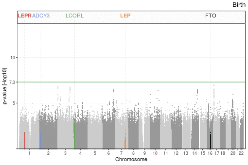

# Publications

This repository lists the scientific publications I co-authored as of 1 August 2019. Citation metrics as obtained from the NIH [iCite](icite.od.nih.gov) are available [here](docs/icite/icite_report_01.08.2019.xlsx).

> :mortar_board: shared first, :older_woman::older_man: shared last, :email: corresponding authorship. 

# Five highlighted original articles

1- Hernández Sánchez LF, Burger B, Horro C, Fabregat A, Johansson S, Njølstad PR, Barsnes H, Hermjakob H, **Vaudel M**:email:, _PathwayMatcher: proteoform-centric network construction enables fine-granularity multi-omics pathway mapping_, GigaScience, 2019. [bioRxiv](https://doi.org/10.1101/375097) [PubMed](https://www.ncbi.nlm.nih.gov/pubmed/31363752) [GigaScience](https://doi.org/10.1093/gigascience/giz088) [pdf](docs/pdf/giz088.pdf)

> 
> _In this manuscript, we describe a bioinformatic tool that can build biological networks of different levels of granularity using the [Reactome](reactome.org) pathway database, and map different types of omics data to it. Notably, it can build a network to the level of [proteoforms](https://www.nature.com/articles/nmeth.2369), where genes and proteins are separated according to their post-translational state. Hence, interactions are more specific, and interactions between different forms of the same proteins become visible as connections between different nodes, thus providing a new dimension to study biological networks. This manuscript is the first output of a project initiated with the Reactome team in 2013, it took an incredible amount of work to complete._

2- Helgeland Ø, *Vaudel M*, Juliusson P, …, Molven A, Johansson S:older_man:, Njølstad PR:older_man:, _Genome-wide association study reveals a dynamic role of common genetic variation in infant and early childhood growth_, Nature Communications, Accepted. [bioRxiv](https://doi.org/10.1101/478255) [Nature Communications](https://go.nature.com/2VeBDRa) [pdf](docs/pdf/478255.full.pdf)

> 
> _The association between genetic variation and phenotypes, _e.g._ with the Body Mass Index (BMI), is often presented as static, yet it changes over the course of life. Here we present-genome wide association results during the first years of life, from birth to age 8, making possibly one of the first genetic time lapse. It represents 12 GWASs on the [MoBa cohort](https://www.fhi.no/studier/moba/forskere/sporreskjemaer---mor-og-barn-unders/), for which we buit a complete bioinformatic environment from scratch._
